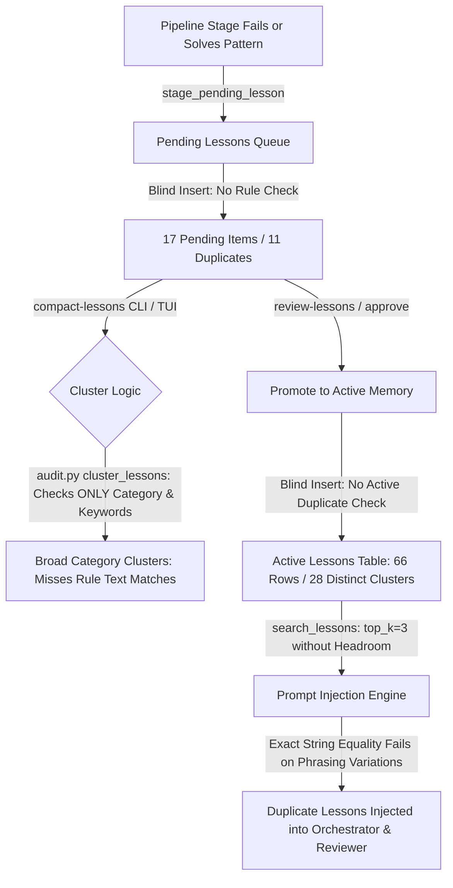
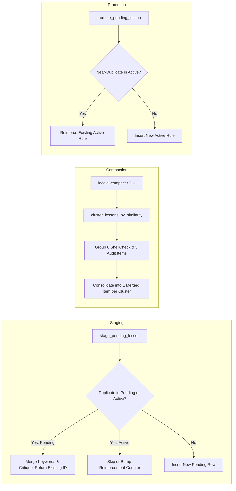

# Lesson Duplication Detection & Queue Deduplication Architecture

This document synthesizes our investigation, root cause analysis, and proposed solutions for lesson duplication across the prompt injection pipeline, active memory store, and the pending review queue.

---

## 1. Executive Summary & Problem Statement

During inspection of pipeline run `run-20260930-054329-169356`, the **Orchestrator** model context window received duplicate lesson rules:
- `lesson-20260918-44`: *"All pipeline runs that receive an 'audit pass' with 'no risks' should be automatically approved."*
- `lesson-20260918-10`: *"All pipeline runs that receive an 'audit pass' with no reported risks should be automatically approved."*

Simultaneously, the **Reviewer** stage received near-duplicate lessons:
- `lesson-20260918-11`: *"All audit passes with no identified risks should be approved."*
- `lesson-20260918-25`: *"All audit passes with no risks should be automatically approved."*

### Upstream Queue Audit (`.localai/memory.db`)

An inspection of the pending review queue revealed that this duplication in active memory is an **upstream symptom of an un-deduplicated pending queue**:

```text
Total Pending Lessons: 17
├── ShellCheck duplicates (8 identical items):
│   ├── pending-20260918-09: "Always quote variables in shell scripts to avoid word splitting and pathname expansion."
│   ├── pending-20260918-10: "Always quote variables in shell scripts to avoid word splitting and pathname expansion."
│   ├── pending-20260918-11: "Always quote variables in shell scripts to avoid word splitting and pathname expansion."
│   ├── pending-20260918-12: "Always quote variables in shell scripts to avoid word splitting and pathname expansion."
│   ├── pending-20260918-13: "Always quote variables in shell scripts to avoid word splitting and pathname expansion."
│   ├── pending-20260918-16: "Always quote variables in shell scripts to avoid word splitting and pathname expansion."
│   ├── pending-20260918-19: "Always quote variables in shell scripts to avoid word splitting and pathname expansion."
│   └── pending-20260929-03: "Always quote variables in shell scripts to avoid word splitting and pathname expansion."
├── Audit duplicates (3 near-identical items):
│   ├── pending-20260918-03: "All audit passes with no identified risks should be approved."
│   ├── pending-20260918-05: "All audit passes with no risks should be automatically approved."
│   └── pending-20260918-07: "All audit passes with no identified risks should be approved."
└── Unique items: 6
```

**11 out of the 17 pending lessons (65%) are redundant duplicates.** When approved, these duplicates flood the active `lessons` table, which in turn pollutes prompt injection across the multi-agent pipeline.

---

## 2. Root Cause Analysis



### Gap 1: Ingestion Stage Has No Deduplication
[`MemoryStore.stage_pending_lesson()`](../sysadmin/mcp_core/memory.py) performs an unconditional `INSERT INTO pending_lessons`. When multiple pipeline runs encounter the same ShellCheck violation (e.g. SC2086), each run creates a separate pending lesson row.

### Gap 2: Queue Compaction Clusters by Metadata, Not Rule Text
[`cluster_lessons()`](../sysadmin/mcp_core/audit.py) groups lessons using connected components based on `_related(a, b)`:
- Shared category (`cat_a == cat_b`), OR
- Shared keywords (`len(shared_keywords) >= 2`).

It completely ignores `proposed_rule` text. As a result:
- Unrelated lessons in the same category are lumped together.
- Near-duplicate rules with slight keyword differences fail to form compaction clusters.

### Gap 3: Promotion Has No Active Duplicate Gate
When human curators or automated flows run `promote_pending_lesson()`, the pending rule is inserted directly into `lessons` without checking if an identical or near-duplicate rule already exists in active memory.

### Gap 4: Retrieval and Prompt Injection Relied on Exact Equality
Before our fix, [`normalize_lesson_rule()`](../sysadmin/mcp_core/injection.py) stripped punctuation and collapsed whitespace, but relied on exact set equality (`norm_rule in seen_rules`). Phrasing variations like `"with 'no risks'"` vs `"with no reported risks"` bypassed deduplication. Furthermore, [`collect_relevant_lessons()`](../sysadmin/pipeline.py) only queried `top_k=3`, meaning duplicate removal would starve the prompt of sufficient lessons.

---

## 3. Work Completed in Current Session

We resolved the downstream prompt injection and retrieval issue:

1. **Fuzzy Token Overlap & Similarity Engine ([`sysadmin/mcp_core/injection.py`](../sysadmin/mcp_core/injection.py))**:
   - Implemented `are_rules_similar(rule1, rule2, threshold=0.75)`.
   - Combines token-level Jaccard similarity with character-level `difflib.SequenceMatcher` ratio:
     $$\text{Jaccard}(A, B) = \frac{|A \cap B|}{|A \cup B|} \ge 0.75 \quad \text{and} \quad \text{Ratio}(A, B) \ge 0.70$$
     or $\text{Ratio}(A, B) \ge 0.92$ on long strings ($> 25$ chars).
   - Avoids false positives on short labels (e.g. `"Rule A"` vs `"Rule C"`, `"bash lesson 0"` vs `"bash lesson 1"`).
   - Updated `deduplicate_lessons()` to evaluate each incoming rule against existing accepted rules using `are_rules_similar()`.
2. **Headroom Querying & Unified Collection ([`sysadmin/pipeline.py`](../sysadmin/pipeline.py))**:
   - Refactored `collect_relevant_lessons()` to query candidate pools with headroom (`max(top_k * 3, 10)`).
   - Delegated all deduplication directly to `deduplicate_lessons()`.
3. **Verification**:
   - Re-querying `.localai/memory.db` for Orchestrator returns `lesson-39`, `lesson-44`, and distinct `lesson-16` (no duplicates).
   - Reviewer returns `lesson-13`, `lesson-11`, and `lesson-44` (no duplicates).
   - Added unit tests in `sysadmin/tests/test_injection.py`.
   - All 363 tests passed cleanly; committed (`a38b947`) and pushed to `feat/arc-orc-rev-pipeline`.

---

## 4. Proposed Solution for the Lesson Queue (Next Session)

To eliminate duplicates at the root, the deduplication engine should be extended across the entire lesson lifecycle:



### Component A: Ingestion Guard (`stage_pending_lesson`)
- **File**: `sysadmin/mcp_core/memory.py`
- **Logic**:
  1. Normalize incoming `proposed_rule`.
  2. Query existing `pending_lessons` (and active `lessons`).
  3. If `are_rules_similar(norm_incoming, norm_existing)`:
     - Merge incoming keywords into the existing row.
     - If incoming contains a reviewer critique, append to `reviewer_critique`.
     - Update `staged_at` timestamp.
     - Return existing `id` without inserting a new row.

### Component B: Rule-Similarity Clustering for Queue Compaction
- **Files**: `sysadmin/mcp_core/audit.py`, `sysadmin/mcp_cli/commands/memory.py`, `sysadmin/lessons_tui/compact_app.py`
- **Logic**:
  - Add `cluster_lessons_by_similarity(lessons, threshold=0.75)`:
    - Forms connected components where `are_rules_similar(a.rule, b.rule)` is `True`.
  - In `_compact_pending()`, use similarity clustering so `localai-compact --queue-only` immediately identifies the 8 identical ShellCheck items and 3 Audit items as compaction clusters.
  - In `CompactQueueApp`, display the clustered duplicates with automatic longest/richest rule selection.

### Component C: Promotion Guard (`promote_pending_lesson`)
- **File**: `sysadmin/mcp_core/memory.py`
- **Logic**:
  - Before inserting into `lessons`, verify that no active lesson matches via `are_rules_similar`.
  - If a match exists:
    - Increment `retrieval_count` or reinforce the active lesson.
    - Delete the pending item.
    - Return the existing active lesson ID.

### Component D: Retroactive Database Cleanup Script
- **Action**: A one-time compaction pass over the existing 17 pending lessons and 66 active lessons in `.localai/memory.db`.
- **Expected Outcome**:
  - Pending lessons: reduced from 17 to 6.
  - Active lessons: duplicates consolidated from 66 down to 28 clean, distinct lessons.

---

## 5. Next Session Implementation Checklist

- [ ] **Step 1**: Update `cluster_lessons` in `sysadmin/mcp_core/audit.py` to support rule text similarity clustering (`cluster_by="rule" | "metadata"`).
- [ ] **Step 2**: Enhance `stage_pending_lesson()` in `sysadmin/mcp_core/memory.py` with pending & active duplicate checks.
- [ ] **Step 3**: Enhance `promote_pending_lesson()` in `sysadmin/mcp_core/memory.py` with active memory duplicate check.
- [ ] **Step 4**: Test interactive and automatic queue compaction with `CompactQueueApp` and `localai-compact --queue-only`.
- [ ] **Step 5**: Run one-time compaction on `.localai/memory.db` to clean up existing duplicates.
- [ ] **Step 6**: Add unit tests in `test_memory.py`, `test_audit.py`, and `test_compact_lessons.py`.
- [ ] **Step 7**: Update `sysadmin/SESSION_RESUME.md` and commit with bisectable conventional gitmoji commits.
