# Architecture Review & Refinements: Lesson Duplication Detection & Queue Compaction

This document captures the architectural review, identified edge cases, and concrete solutions for the proposed lesson deduplication design outlined in [`fix-lesson-duplication-detection.md`](fix-lesson-duplication-detection.md).

---

## 1. Overview & Context

In [`fix-lesson-duplication-detection.md`](fix-lesson-duplication-detection.md), we established the root cause of lesson duplication across prompt injection, active memory (`lessons`), and the pending review queue (`pending_lessons`):
1. Downstream prompt injection was fixed by adding fuzzy token overlap matching (`are_rules_similar`) and headroom querying (`max(top_k * 3, 10)`).
2. Upstream ingestion (`stage_pending_lesson`), queue compaction (`cluster_lessons`), and promotion (`promote_pending_lesson`) were identified as the root entry points where duplicates accumulate.

A code-level audit of [`sysadmin/mcp_core/memory.py`](../sysadmin/mcp_core/memory.py), [`sysadmin/mcp_core/audit.py`](../sysadmin/mcp_core/audit.py), [`sysadmin/mcp_cli/commands/memory.py`](../sysadmin/mcp_cli/commands/memory.py), [`sysadmin/lessons_tui/compact_app.py`](../sysadmin/lessons_tui/compact_app.py), and related test suites revealed **8 architectural gaps and failure modes** that must be accounted for during implementation.

---

## 2. Identified Problems & Technical Solutions

### Problem 1: `lessons.md` Store Desynchronization on Promoted Duplicates (Critical)

#### Problem
In Component C (Promotion Guard), the proposal states:
> *"Before inserting into `lessons`, verify that no active lesson matches via `are_rules_similar`. If a match exists: reinforce the active lesson, delete the pending item, and return the existing active lesson ID."*

However, in both the CLI (`ReviewLessonsCommand`) and TUI (`ReviewLessonsApp`):
```python
# sysadmin/mcp_cli/commands/memory.py
lesson_id = store.promote_pending_lesson(item["id"])
if lesson_id:
    promoted = store.get_lesson(lesson_id)
    if promoted:
        append_lesson_to_markdown(promoted, lessons_md_path)
```
```python
# sysadmin/lessons_tui/app.py
promoted_id = store.promote_pending_lesson(lid)
if promoted_id:
    promoted = store.get_lesson(promoted_id)
    if promoted:
        append_lesson_to_markdown(promoted, self.lessons_md)
```
If `promote_pending_lesson` returns an existing active lesson ID, the caller passes that record to [`append_lesson_to_markdown()`](../sysadmin/mcp_core/lessons_writer.py), which blindly appends the lesson block to `lessons.md`.
**Failure Mode:** `memory.db` has 1 clean row, but `lessons.md` accumulates duplicate YAML frontmatter entries every time an existing lesson is promoted.

#### Solution
1. **Explicit Return Contract:** Update `promote_pending_lesson()` to return a structured tuple or result object:
   ```python
   def promote_pending_lesson(
       self, pending_id: str, edits: Optional[dict] = None
   ) -> tuple[Optional[str], bool]:
       """Returns (lesson_id, is_new).
       
       If a near-duplicate active lesson exists, is_new is False and the existing
       active lesson is reinforced/updated without a new insertion.
       """
   ```
2. **Idempotent Caller Handling:** In CLI and TUI:
   ```python
   lesson_id, is_new = store.promote_pending_lesson(item["id"], edits=edits)
   if lesson_id and is_new:
       promoted = store.get_lesson(lesson_id)
       append_lesson_to_markdown(promoted, lessons_md_path)
   elif lesson_id and not is_new:
       # Update lessons.md if rule or keywords were enriched during promotion
       write_all_lessons_to_markdown(store.list_lessons(), lessons_md_path)
   ```

---

### Problem 2: Active Match Ambiguity & Telemetry Context in `stage_pending_lesson`

#### Problem
In Component A (Ingestion Guard), the proposal states:
> *"Query existing `pending_lessons` (and active `lessons`). If similar: merge incoming keywords, append critique, update `staged_at`, return existing `id` without inserting a new row."*

1. **Return Value Contract:** Callers in [`sysadmin/pipeline.py`](../sysadmin/pipeline.py) execute:
   ```python
   staged_id = memory_store.stage_pending_lesson(fail_lesson)
   logger.info("Staged pending lesson %s", staged_id)
   ```
   Callers expect a non-empty string ID.
2. **Queue Pollution:** If the incoming failure matches an **active** lesson, staging it in `pending_lessons` would defeat the purpose of deduplication. It should NOT be inserted into `pending_lessons`.
3. **Telemetry Semantics:** A pipeline failure occurs when a tool, test, or review stage fails. If the failed rule *already exists in active memory*, the model failed despite the lesson being available (or retrieval failed to surface it). Bumping `retrieval_count` is misleading; incrementing `ineffective_count` accurately captures that the rule was breached in practice.

#### Solution
When `stage_pending_lesson()` evaluates the incoming rule:
1. **Check Active Lessons First:**
   - If `are_rules_similar(norm_incoming, norm_active)` matches `active_lesson`:
     - Increment `ineffective_count` (or log telemetry) on `active_lesson["id"]`.
     - Do **not** insert into `pending_lessons`.
     - Return `active_lesson["id"]`.
2. **Check Pending Lessons Second:**
   - If `are_rules_similar(norm_incoming, norm_pending)` matches `pending_lesson`:
     - Merge unique keywords into the pending item.
     - Append reviewer critique if present.
     - Update `staged_at` timestamp.
     - Return `pending_lesson["id"]`.
3. **Otherwise:**
   - Insert new row into `pending_lessons` and return newly generated `pending_id`.

---

### Problem 3: Purpose Conflict in `cluster_lessons()` (`wiki.py` vs Deduplication Compaction)

#### Problem
In Component B, the proposal states:
> *"Update `cluster_lessons` in `sysadmin/mcp_core/audit.py` to support rule text similarity clustering."*

Currently, [`cluster_lessons()`](../sysadmin/mcp_core/audit.py) clusters by:
```python
def _related(a: dict, b: dict) -> bool:
    shared = _normalize_keywords(a) & _normalize_keywords(b)
    if len(shared) >= 2:
        return True
    cat_a = (a.get("category") or "").strip().lower()
    cat_b = (b.get("category") or "").strip().lower()
    return bool(cat_a and cat_a == cat_b)
```
1. **Wiki Promotion Candidates:** [`sysadmin/mcp_core/wiki.py`](../sysadmin/mcp_core/wiki.py) and `localai audit-lessons` use `cluster_lessons()` with `min_cluster_size=3` to identify high-level domain areas with multiple lessons. Changing `cluster_lessons` default behavior breaks existing wiki generation and unit tests in [`test_audit.py`](../sysadmin/tests/test_audit.py).
2. **Compaction Requirements:** Compaction requires:
   - Pairwise duplicate grouping (`min_cluster_size=2`).
   - Strict rule-text similarity (`are_rules_similar`), irrespective of whether the LLM assigned slightly different categories (e.g. `"ShellCheck"` vs `"Defensive Bash Scripting"`).

#### Solution
Separate high-level metadata grouping from text-similarity compaction:
- Retain `cluster_lessons(lessons, min_cluster_size=3)` for metadata/taxonomy clustering in `wiki.py` and `audit-lessons`.
- Add a dedicated, pure clustering function:
  ```python
  def cluster_lessons_by_similarity(
      lessons: List[dict],
      min_cluster_size: int = 2,
      threshold: float = DEFAULT_SIMILARITY_THRESHOLD,
  ) -> List[dict]:
      """Group lessons into duplicate clusters using connected components over are_rules_similar.
      
      Clusters are formed purely on rule-text similarity. Returns clusters with
      count >= min_cluster_size, sorted by cluster size descending.
      """
  ```
- Route [`_compact_pending()`](../sysadmin/mcp_cli/commands/memory.py), [`_compact_active()`](../sysadmin/mcp_cli/commands/memory.py), and [`CompactQueueApp`](../sysadmin/lessons_tui/compact_app.py) to `cluster_lessons_by_similarity()`.

---

### Problem 4: Test Suite Fixture Regressions & Testability Hook (`deduplicate=True`)

#### Problem
1. **Existing Compaction Tests:** Existing unit tests in [`test_compact_lessons.py`](../sysadmin/tests/test_compact_lessons.py) and [`test_compact_queue_tui.py`](../sysadmin/tests/test_compact_queue_tui.py) staged dissimilar rules to test cluster compaction:
   ```python
   # test_compact_lessons.py
   store.stage_pending_lesson({"proposed_rule": "Short rule A", "category": "Scripting", ...})
   store.stage_pending_lesson({"proposed_rule": "Longer and much more descriptive rule B", "category": "Scripting", ...})
   ```
   These clustered only because they shared `category: "Scripting"`. Under rule-similarity clustering, these tests will fail because the rules are completely different.
2. **Ingestion Invariant:** If `stage_pending_lesson` deduplicates unconditionally, tests attempting to stage multiple duplicate items to test the compaction UI/CLI will have the duplicates collapsed immediately at staging time.

#### Solution
1. **Testability Parameter:** Add a `deduplicate: bool = True` parameter to `stage_pending_lesson()`:
   ```python
   def stage_pending_lesson(self, lesson: dict, deduplicate: bool = True) -> str:
   ```
   This allows tests and migration utilities to populate synthetic duplicate queues when validating compaction and UI behavior.
2. **Update Test Fixtures:** Update `test_compact_lessons.py` and `test_compact_queue_tui.py` to use authentic phrasing variants:
   - Primary: *"Always quote variables in shell scripts to avoid word splitting."*
   - Duplicate: *"Quote all variables in bash scripts to prevent word splitting and pathname expansion."*

---

### Problem 5: Stale Embeddings on Active Lesson Compaction

#### Problem
In `MemoryStore`, the `lessons` table includes an optional `embeddings BLOB` column for vector search (`sqlite-vec`).
When `_compact_active` merges a cluster into `primary_id` and picks `best_rule = max(..., key=len)`:
```python
store.update_lesson(primary_id, {
    "rule": best_rule,
    "category": category,
    "keywords": merged_keywords,
    ...
})
```
[`update_lesson()`](../sysadmin/mcp_core/memory.py) filters updates using `LESSON_COLUMNS` (which does not include `embeddings`). The rule text changes, but the stored vector embedding remains tied to the old text.
**Failure Mode:** Hybrid and vector search will retrieve the lesson using stale embedding vectors that do not match the updated merged rule.

#### Solution
In `_compact_active()` (or within `update_lesson` when `rule` changes):
- Invalidate the embedding (`embeddings = NULL`) so `sqlite-vec` does not return stale semantic matches, or
- Schedule/trigger re-embedding if embedding generation is configured.

---

### Problem 6: Taxonomy Re-Evaluation on Merged Keywords

#### Problem
When multiple duplicate items are compacted or staged, keywords are merged via `list(dict.fromkeys(union_keywords))`.
An individual incoming item may have had an `"unknown"` or generic category due to sparse keywords. However, the combined keyword set often contains canonical domain signals (e.g. `sc2086`, `quoting`, `bash`).

#### Solution
When merging duplicate items in `stage_pending_lesson` and compaction:
```python
merged_keywords = list(dict.fromkeys(union_keywords))
re_evaluated_category = normalize_category(merged_keywords, current_category)
```
This automatically promotes generic categories to canonical domains in `taxonomy.json` without human intervention.

---

### Problem 7: Redundancy of a One-Off Cleanup Script vs Enhancing `localai-compact`

#### Problem
Component D proposes:
> *"A one-time compaction pass over the existing 17 pending lessons and 66 active lessons in `.localai/memory.db`."*

Writing a separate, disposable cleanup script duplicates the logic in `localai-compact`. [`CompactLessonsCommand`](../sysadmin/mcp_cli/commands/memory.py) already features:
- `--dry-run` and `--auto` execution modes.
- Combined telemetry accumulation (`retrievals`, `prevented_rework`).
- Markdown store re-writing (`write_all_lessons_to_markdown`).
- Automatic wiki re-generation (`index.md`, `dashboard.md`, `log.md`).

#### Solution
Do not build a throwaway script. Once `cluster_lessons_by_similarity()` is wired into `_compact_pending()` and `_compact_active()`:
- Running `localai-compact --dry-run` previews the consolidation of the 17 pending items and 66 active lessons.
- Running `localai-compact --auto` executes the one-time cleanup natively and remains permanently available for ongoing repository maintenance.

---

### Problem 8: Centralized Threshold Configuration

#### Problem
Currently:
- `are_rules_similar(rule1, rule2, threshold=0.75)` in [`injection.py`](../sysadmin/mcp_core/injection.py) defaults to `0.75`.
- `deduplicate_lessons(lessons, similarity_threshold=0.78)` overrides it with `0.78`.
- Ad-hoc thresholds in upcoming components risk drifting apart.

#### Solution
Define a single canonical constant in [`sysadmin/mcp_core/injection.py`](../sysadmin/mcp_core/injection.py):
```python
DEFAULT_SIMILARITY_THRESHOLD: float = 0.75
```
Export and reference `DEFAULT_SIMILARITY_THRESHOLD` across `injection.py`, `memory.py`, and `audit.py`.

---

## 3. End-to-End Lesson Lifecycle Flow

```mermaid
graph TD
    subgraph Staging ["1. Ingestion Guard (stage_pending_lesson)"]
        In[Incoming Lesson] --> A1{Similar to Active Lesson?}
        A1 -->|Yes| A2[Bump ineffective_count on Active<br/>Do not stage<br/>Return active ID]
        A1 -->|No| A3{Similar to Pending Lesson?}
        A3 -->|Yes| A4[Merge Keywords & Critiques<br/>Re-evaluate Category<br/>Return pending ID]
        A3 -->|No| A5[Insert into pending_lessons<br/>Return new pending ID]
    end

    subgraph Compaction ["2. Queue & Active Compaction (localai-compact)"]
        C1[cluster_lessons_by_similarity] --> C2[Identify connected components with similarity >= 0.75]
        C2 --> C3[Select best rule via max len<br/>Union keywords & normalize category<br/>Aggregate telemetry counters]
        C3 --> C4[Update primary record & delete duplicate IDs]
        C4 --> C5[Clear stale vector embeddings<br/>Re-sync lessons.md via write_all_lessons_to_markdown<br/>Rebuild wiki pages]
    end

    subgraph Promotion ["3. Promotion Guard (promote_pending_lesson)"]
        P1[Human or Auto Promotion] --> P2{Similar to Active Lesson?}
        P2 -->|Yes| P3[Reinforce Active Lesson<br/>Delete pending item<br/>Return active_id, is_new=False]
        P2 -->|No| P4[Insert into lessons<br/>Delete pending item<br/>Return new_id, is_new=True]
        P3 --> P5[Caller skips append_lesson_to_markdown<br/>Re-syncs lessons.md if enriched]
        P4 --> P6[Caller calls append_lesson_to_markdown]
    end
```



---

## 4. Refined Implementation Checklist

- [ ] **Step 1: Constants & Pure Similarity Clustering**
  - Define `DEFAULT_SIMILARITY_THRESHOLD = 0.75` in `sysadmin/mcp_core/injection.py`.
  - Implement `cluster_lessons_by_similarity(lessons, min_cluster_size=2, threshold=DEFAULT_SIMILARITY_THRESHOLD)` in `sysadmin/mcp_core/audit.py`.
  - Preserve `cluster_lessons()` for category/metadata clustering in `wiki.py`.
- [ ] **Step 2: Ingestion Guard (`stage_pending_lesson`)**
  - Add active memory duplicate check (bumps `ineffective_count`, returns `active_id`).
  - Add pending memory duplicate check (merges keywords, critiques, re-normalizes category, returns `pending_id`).
  - Add `deduplicate: bool = True` argument for testing and migration control.
- [ ] **Step 3: Promotion Guard (`promote_pending_lesson`)**
  - Check for active duplicates before inserting.
  - Return `tuple[Optional[str], bool]` indicating `(lesson_id, is_new)`.
  - Update callers in `sysadmin/mcp_cli/commands/memory.py` and `sysadmin/lessons_tui/app.py` to prevent duplicate appends to `lessons.md`.
- [ ] **Step 4: Compaction Upgrades & Embedding Invalidation**
  - Update `_compact_pending()`, `_compact_active()`, and `CompactQueueApp` to use `cluster_lessons_by_similarity()`.
  - Invalidate stale `embeddings` when active lesson rules are updated.
  - Re-normalize categories from merged keywords during consolidation.
- [ ] **Step 5: Test Fixture Updates & Comprehensive Test Suite**
  - Update test fixtures in `test_compact_lessons.py` and `test_compact_queue_tui.py` to use phrasing variants.
  - Add unit tests verifying `is_new=False` behavior during duplicate promotions.
  - Add unit tests verifying active rule matches bypass pending queue insertion.
- [ ] **Step 6: Execute Compaction via `localai-compact`**
  - Run `localai-compact --dry-run` to preview pending and active memory cleanup.
  - Run `localai-compact --auto` to compact the 17 pending items and 66 active lessons.
  - Verify `lessons.md` and `ollama_update/wiki` are cleanly regenerated.
