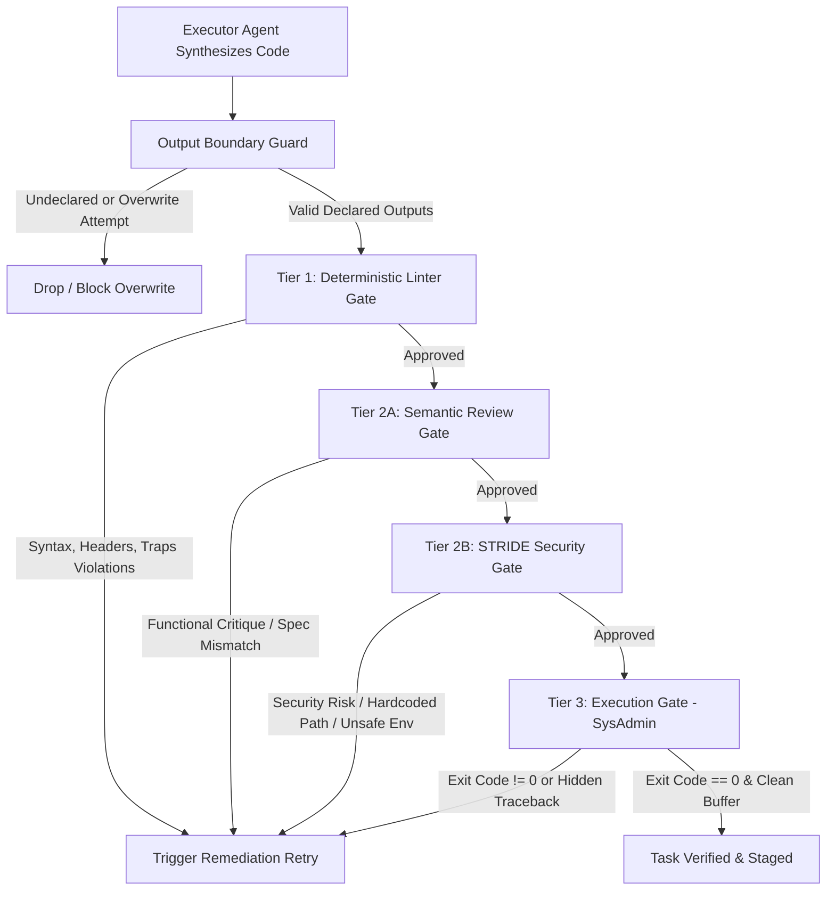
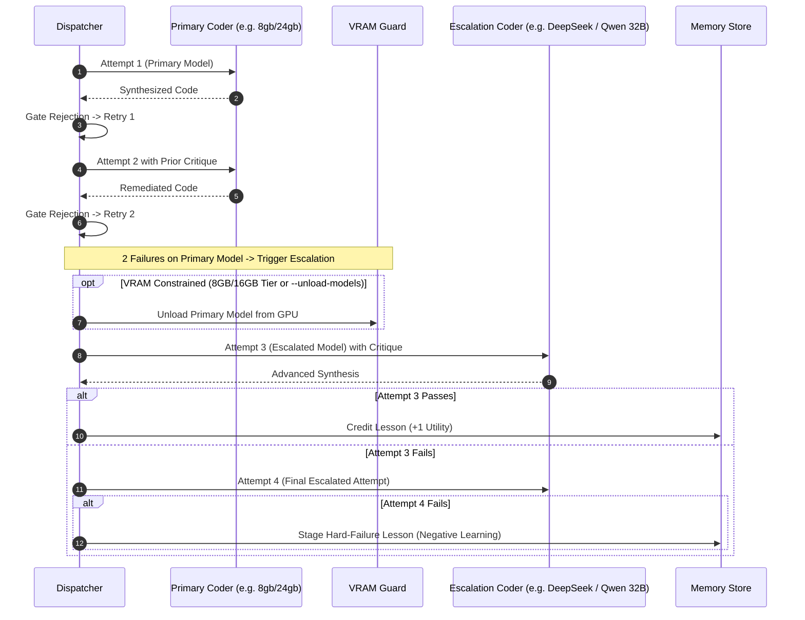

# Pipeline Retry Budget, Verification Gates, and Model Escalation

This document details the retry budgets, multi-tier verification gates, and dynamic model escalation mechanics enforced across the multi-agent pipeline (`sysadmin/pipeline.py`).

---

## 1. Phase Budgets & Revisions

Each major phase in the pipeline operates under an explicit budget to guarantee bounded execution and prevent infinite loop costs on local inference hardware:

| Phase | Default Budget | Evaluator / Gate | On Budget Exhaustion |
| :--- | :--- | :--- | :--- |
| **Architect** | **3 attempts** (`architect_budget = 3`) | Auditor Reviewer checks DAG structure, decomposition granularity, and tool/domain tags. | Pipeline aborts with `status = "aborted"`. A `hard_failure` lesson is staged to `.localai/memory.db`. |
| **Orchestrator** | **3 attempts** (`orchestrator_budget = 3`) | Schema validator checks input/output bindings, dependencies, and cycle avoidance. | Pipeline aborts; emits `budget_exhausted` event. |
| **Task Dispatch** | **2 or 3 retries** (3 or 4 attempts) | Multi-tier verification gates (Linter, Semantic Review, Security STRIDE, Execution). | Task marked as `failed`; downstream tasks blocked; failure critique captured into MemoryStore. |

---

## 2. Multi-Tier Task Verification Gates

Before any generated task script or configuration is written to disk or executed by the `sysadmin` agent, it must pass sequential verification gates:

1. **Output Boundary Guard**:
   - Ensures tasks only emit declared file outputs.
   - Blocks subsequent tasks from overwriting verified files authored by earlier tasks.
2. **Tier 1: Deterministic Linter Gate** (`validate_code_output`):
   - ShellCheck, python syntax, bash headers (`set -euo pipefail`), required traps, and deterministic virtualenv binary checks.
3. **Tier 2A: Semantic Review Gate** (*Reviewer Agent*):
   - Confirms the code satisfies all prompt directives, avoids empty mocks, and handles edge cases.
4. **Tier 2B: STRIDE Security Gate** (*Security Agent*):
   - Evaluates threat models (Spoofing, Tampering, Info Disclosure, Elevation of Privilege), validates that secrets use `$GH_TOKEN`/`$OLLAMA_HOST`, and asserts sanitization (no hardcoded `/home/<user>`).
5. **Tier 3: Execution Gate** (*SysAdmin*):
   - Executes with non-destructive check-mode first, asserts returncode `== 0`, and inspects terminal buffers for hidden tracebacks or permission faults.

---

## 3. Dynamic Model Escalation & VRAM Safety

When tasks fail initial gate reviews, the pipeline utilizes a tiered escalation model strategy that adapts to available system VRAM:

### Escalation Parameters

- **Standard Budget (`--no-escalation` or `escalation_model == primary_model`)**:
  - `max_retries = 2` (3 total attempts).
  - All attempts execute against the primary model.
- **Escalated Budget (Default)**:
  - `max_retries = 3` (4 total attempts).
  - **Attempts 1 & 2**: Run on the primary model (e.g., `winter-coder:8gb` or `winter-coder:24gb`).
  - **Escalation Transition (Attempt 3)**: Triggered when `retries == 2`. The pipeline promotes the task to the designated escalation model (`resolve_escalation_model()`).
  - **VRAM Cleanup Guard**: On hardware tiers with $\le 16\text{ GB}$ VRAM (or when `--unload-models` is passed), the primary model is actively unloaded via Ollama before loading the escalation model to prevent OOM errors.

---

## 4. In-Flight Feedback & Autonomous Learning

1. **Iterative Critique Injection**:
   - Every rejection populates `task_msg["prior_critique"]` and updates `task_msg["revision"] = retries`.
   - The coder receives exact line-level compiler errors, linter violations, and reviewer feedback.
2. **Success Attribution**:
   - Lessons injected from `MemoryStore` that helped a task pass verification receive $+1$ utility credit.
3. **Failure Capture**:
   - If a task completely exhausts its retry budget, `extract_lesson_from_critique()` automatically distills the failure rationale into a persistent `hard_failure` rule staged into `.localai/memory.db`.

---

## 5. CLI Controls & State Flags

The retry and escalation behavior can be configured via CLI flags:

| Flag | Default | Effect |
| :--- | :--- | :--- |
| `--retry-budget, --max-retries <N>` | Phase defaults (`3` / `2`) | Sets configurable retry budget across stages & tasks (bounded: `min=1`, `max=15`). |
| `--tier {8gb,16gb,24gb}` | Auto-detected | Sets default and escalation models tailored to GPU capacity. |
| `--no-escalation` | `False` | Disables model promotion; caps task retries to the configured budget on the primary model. |
| `--coder-model <name>` | Auto-resolved | Pinned override for the primary coder model across all tasks. |
| `--escalation-model <name>`| Auto-resolved | Pinned override for the fallback escalation model. |
| `--unload-models` | `False` | Forces Ollama to unload models after each phase or escalation step. |
| `--keep-models` | `False` | Prevents unloading models between stages for faster execution on high-VRAM systems. |
