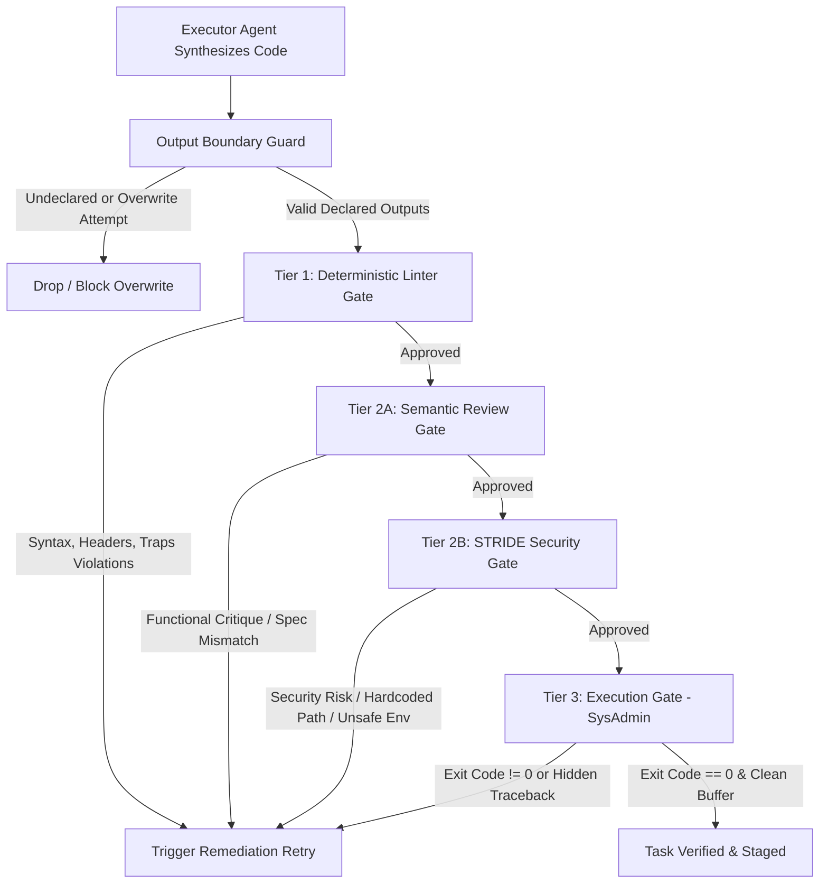
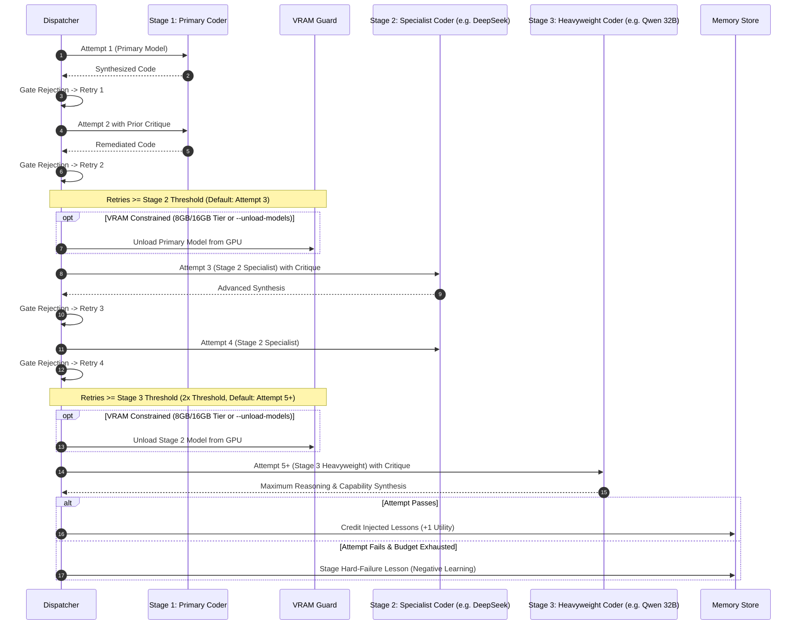

# Pipeline Retry Budget, Verification Gates, and Model Escalation

This document details the retry budgets, multi-tier verification gates, and dynamic model escalation mechanics enforced across the multi-agent pipeline (`sysadmin/pipeline.py`).

---

## 1. Phase Budgets & Revisions

Each major phase in the pipeline operates under an explicit budget to guarantee bounded execution and prevent infinite loop costs on local inference hardware:

| Phase | Default Budget | Evaluator / Gate | On Budget Exhaustion |
| :--- | :--- | :--- | :--- |
| **Architect** | **3 attempts** (`architect_budget = 3`) | Auditor Reviewer checks DAG structure, decomposition granularity, and tool/domain tags. | Pipeline aborts with `status = "aborted"`. A `hard_failure` lesson is staged to `.localai/memory.db`. |
| **Orchestrator** | **3 attempts** (`orchestrator_budget = 3`) | Schema validator checks input/output bindings, dependencies, and cycle avoidance. | Pipeline aborts; emits `budget_exhausted` event. |
| **Task Dispatch** | **2 or 3 retries** (3 or 4 attempts) | Multi-tier verification gates (Linter, Semantic Review, Security STRIDE, Execution). | Task marked as `failed`; downstream tasks blocked; failure critique captured into MemoryStore. |

---

## 2. Multi-Tier Task Verification Gates

Before any generated task script or configuration is written to disk or executed by the `sysadmin` agent, it must pass sequential verification gates:



1. **Output Boundary Guard**:
   - Ensures tasks only emit declared file outputs.
   - Blocks subsequent tasks from overwriting verified files authored by earlier tasks.
2. **Tier 1: Deterministic Linter Gate** (`validate_code_output`):
   - ShellCheck, python syntax, bash headers (`set -euo pipefail`), required traps, and deterministic virtualenv binary checks.
3. **Tier 2A: Semantic Review Gate** (*Reviewer Agent*):
   - Confirms the code satisfies all prompt directives, avoids empty mocks, and handles edge cases.
4. **Tier 2B: STRIDE Security Gate** (*Security Agent*):
   - Evaluates threat models (Spoofing, Tampering, Info Disclosure, Elevation of Privilege), validates that secrets use `$GH_TOKEN`/`$OLLAMA_HOST`, and asserts sanitization (no hardcoded `/home/<user>`).
5. **Tier 3: Execution Gate** (*SysAdmin*):
   - Executes with non-destructive check-mode first, asserts returncode `== 0`, and inspects terminal buffers for hidden tracebacks or permission faults.

---

## 3. Dynamic Multi-Tier Model Escalation & VRAM Safety

When tasks fail initial gate reviews, the pipeline utilizes a tiered escalation ladder that adapts to available system VRAM:



### Multi-Tier Model Escalation Ladder

| Hardware Tier | Stage 1: Primary Coder (Attempts 1 to $T$) | Stage 2: Specialist Coder (Attempts $T+1$ to $2T$) | Stage 3: Heavyweight Winter Coder (Attempts $2T+1$ to `max_retries`) |
| :--- | :--- | :--- | :--- |
| **8GB Tier** (Laptop) | `winter-coder:8gb` | `deepseek-r1:8b` (CoT Reasoning) | `winter-coder:8gb-deepseek` (or `winter-prime:8gb`) |
| **16GB Tier** (Workstation) | `winter-coder:16gb` | `deepseek-coder-v2:16b` (Specialist MoE) | `winter-coder:16gb-deepseek` (or `winter-prime:16gb`) |
| **24GB Tier** (Valkyrie / RTX 3090) | `winter-coder:24gb` (or `winter-coder:16gb` dual-model) | `deepseek-coder-v2:16b` (Specialist MoE) | `winter-coder:24gb-codestral` / `winter-coder:24gb-deepseek` / `winter-prime:24gb` |

### The "Stable" of Winter Coders

To avoid relying on generic foundation models during failure remediation, the pipeline maintains a dedicated **Stable of Winter Coders** tailored per hardware envelope:

- **8GB Tier**:
  - `winter-coder:8gb`: Built on `qwen2.5-coder:7b` (high general code generation).
  - `winter-coder:8gb-deepseek`: Built on `deepseek-r1:8b` (deep chain-of-thought `<think>` reasoning for tricky edge cases under tight VRAM).
- **16GB Tier**:
  - `winter-coder:16gb`: Built on `qwen2.5-coder:14b` (strong code synthesis & ShellCheck adherence).
  - `winter-coder:16gb-deepseek`: Built on `deepseek-coder-v2:16b` (MoE architecture with 32k context for AST diffs and refactoring).
- **24GB Tier**:
  - `winter-coder:24gb`: Built on `qwen2.5-coder:32b` (32B flagship precision coder).
  - `winter-coder:24gb-codestral`: Built on `codestral:latest` (22B high-throughput parameters; exceptional speed and performance on DevOps, Bash, and Ansible tasks).
  - `winter-coder:24gb-deepseek`: Built on `deepseek-coder-v2:16b` (MoE algorithmic coding powerhouse).

### Telemetry & Domain-Aware Model Ranking

Every attempt executed by a model is recorded in the SQLite database (`.localai/memory.db`) via the `model_performance` table:

```sql
CREATE TABLE IF NOT EXISTS model_performance (
    id INTEGER PRIMARY KEY AUTOINCREMENT,
    run_id TEXT NOT NULL,
    task_id TEXT NOT NULL,
    model TEXT NOT NULL,
    role TEXT NOT NULL,
    domain_tag TEXT NOT NULL,
    success INTEGER NOT NULL,
    retries INTEGER NOT NULL DEFAULT 0,
    recorded_at TEXT NOT NULL
);
```

When escalating to Stage 3, instead of static model selection, the pipeline evaluates candidate models from the stable using **Laplace smoothing**:

$$\text{Score} = \frac{\text{successes} + 1}{\text{attempts} + 2}$$

- **Domain Specificity (70%) vs Global Reliability (30%)**: If empirical telemetry exists for the task's domain tags (e.g. `devops`, `bash`, `python`, `security`), domain-specific win rate is weighted 70% and global win rate 30%.
- **Cold-Start Protection**: Unobserved models receive a neutral prior of 0.5 ($\frac{0+1}{0+2}$), ensuring newly built models are explored without being starved of opportunities.
- **Dynamic Selection**: Tasks tagged with `devops` will dynamically favor `winter-coder:24gb-codestral`, while tasks tagged with `algorithmic` or `refactoring` will favor `winter-coder:24gb-deepseek`.

### Escalation Parameters & Thresholds

- **Winter Models Preferred**:
  - The pipeline defaults exclusively to customized Winter models (`winter-coder:<tier>` and `winter-prime:<tier>`) rather than raw foundation models, guaranteeing built-in ShellCheck standards, error traps, and strict context sizing.
- **Configurable Escalation Threshold ($T$)**:
  - Controlled via `--escalation-threshold <N>` (min: 1, max: 15, default: 2; or 1 if `max_retries == 1`).
  - **Stage 1 (Primary)**: Handles attempts 1 through $T$.
  - **Stage 2 (Specialist)**: Promoted when `retries >= stage2_threshold` ($T$). Runs through attempt $2T$.
  - **Stage 3 (Stable Escalation)**: Promoted when `retries >= stage3_threshold` ($2T$). Dynamically ranks alternative Winter Coders in the stable using historical domain performance. If all alternatives match the primary model, it automatically escalates to `winter-prime:<tier>` for fresh multi-persona cognitive framing.
- **Immediate Escalation Example ($T = 1$)**:
  - Attempt 1: Stage 1 Primary (`winter-coder:24gb`)
  - Attempt 2: Stage 2 Specialist (`deepseek-coder-v2:16b`)
  - Attempt 3+: Stage 3 Winter Stable (`winter-coder:24gb-codestral` or top-ranked alternative)
- **Standard Escalation Example ($T = 2, \text{retry\_budget} = 6$)**:
  - Attempts 1 & 2: Stage 1 Primary (`winter-coder:24gb`)
  - Attempts 3 & 4: Stage 2 Specialist (`deepseek-coder-v2:16b`)
  - Attempts 5 & 6: Stage 3 Winter Stable (`winter-coder:24gb-codestral` or `winter-coder:24gb-deepseek`)
- **Strict Single-Model (`--no-escalation`)**:
  - Disables both Stage 2 and Stage 3 escalations; all retries execute exclusively against the primary model.
- **VRAM Cleanup Guard**:
  - On hardware tiers with $\le 16\text{ GB}$ VRAM (or when `--unload-models` is passed), the prior model is actively unloaded via Ollama before loading Stage 2 and Stage 3 models to prevent GPU out-of-memory errors.

---

## 4. In-Flight Feedback & Autonomous Learning

1. **Iterative Critique Injection**:
   - Every rejection populates `task_msg["prior_critique"]` and updates `task_msg["revision"] = retries`.
   - The coder receives exact line-level compiler errors, linter violations, and reviewer feedback.
2. **Success Attribution**:
   - Lessons injected from `MemoryStore` that helped a task pass verification receive $+1$ utility credit.
3. **Failure Capture**:
   - If a task completely exhausts its retry budget, `extract_lesson_from_critique()` automatically distills the failure rationale into a persistent `hard_failure` rule staged into `.localai/memory.db`.

---

## 5. CLI Controls & State Flags

The retry and escalation behavior can be configured via CLI flags:

| Flag | Default | Effect |
| :--- | :--- | :--- |
| `--retry-budget, --max-retries <N>` | Phase defaults (`3` / `2`) | Sets configurable retry budget across stages & tasks (bounded: `min=1`, `max=15`). |
| `--escalation-threshold <N>` | `2` (or `1` if `max_retries == 1`) | Sets retry count before escalating model stages (bounded: `min=1`, `max=15`). Stage 2 triggers at $T$, Stage 3 triggers at $2T$. |
| `--tier {8gb,16gb,24gb}` | Auto-detected | Sets default, Stage 2, and Stage 3 models tailored to GPU capacity. |
| `--no-escalation` | `False` | Disables model promotion; caps task retries to the configured budget on the primary model. |
| `--coder-model <name>` | Auto-resolved | Pinned override for the primary coder model across all tasks. |
| `--escalation-model <name>`| Auto-resolved | Pinned override for the Stage 2 specialist escalation model. |
| `--secondary-escalation-model <name>` | Auto-resolved | Pinned override for the Stage 3 heavyweight escalation model. |
| `--unload-models` | `False` | Forces Ollama to unload models after each phase or escalation step. |
| `--keep-models` | `False` | Prevents unloading models between stages for faster execution on high-VRAM systems. |
