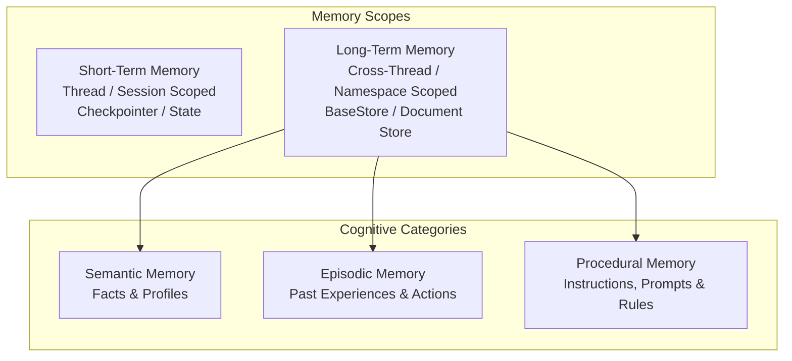
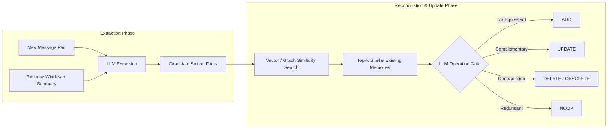
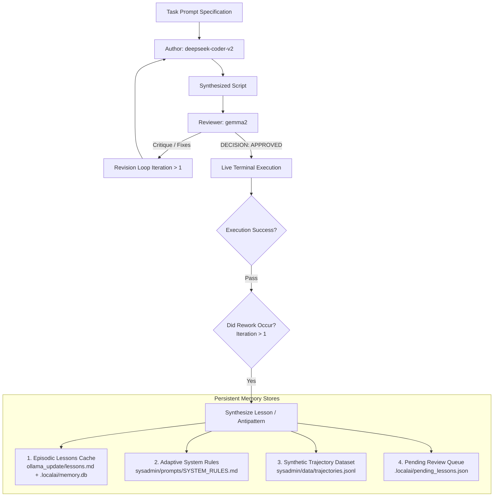
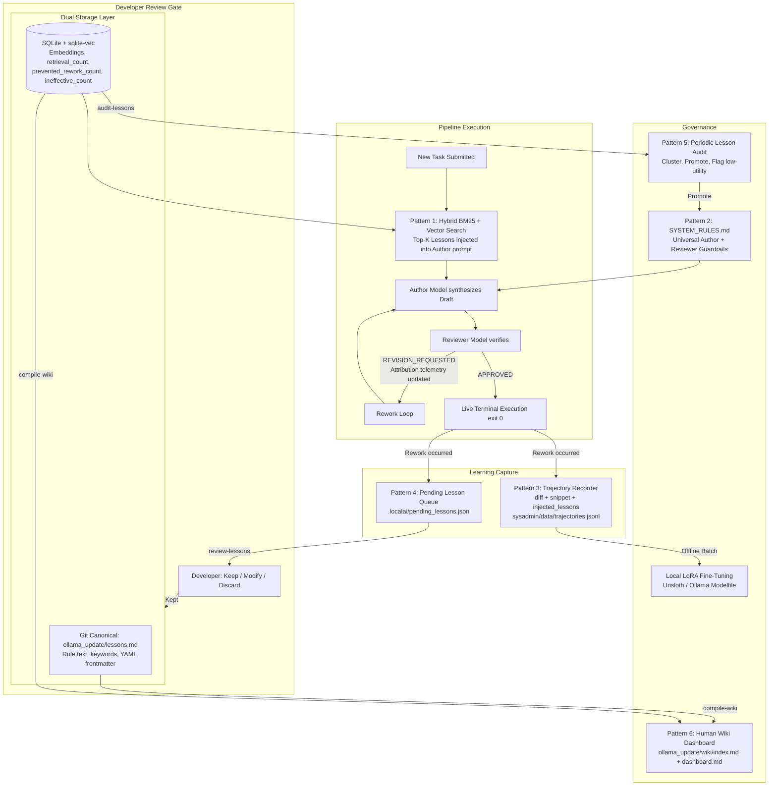

# AI Agent Memory & Self-Learning: Architectural Synthesis & Discussion Document

> **Executive Summary**: This document synthesizes key paradigms, academic research, industrial frameworks, and cognitive perspectives on AI Agent Memory, along with concrete architectural proposals for enabling local LLMs in this repository to learn persistently from rework, do-overs, and review critiques.

---

## Table of Contents
1. [Core Paradigms & Literature Review](#1-core-paradigms--literature-review)
   - [A. Karpathy: The LLM-Wiki Pattern (Compiled & Compounding Artifacts)](#a-karpathy-the-llm-wiki-pattern-compiled--compounding-artifacts)
   - [B. LangChain: Memory Taxonomy & Operational Modes](#b-langchain-memory-taxonomy--operational-modes)
   - [C. Yadav / Activated Thinker: Cognitive Offloading & Human Intentionality](#c-yadav--activated-thinker-cognitive-offloading--human-intentionality)
   - [D. Mem0 & Mem0g (arXiv:2504.19413): Dynamic Extraction, Reconciliation & Graph Memory](#d-mem0--mem0g-arxiv250419413-dynamic-extraction-reconciliation--graph-memory)
   - [E. Letta / MemGPT: The Operating System Paradigm & Sleep-Time Compute](#e-letta--memgpt-the-operating-system-paradigm--sleep-time-compute)
2. [Comparative Analysis of AI Memory Architectures](#2-comparative-analysis-of-ai-memory-architectures)
3. [Local AI Pipeline: Learning from Rework & Do-Overs](#3-local-ai-pipeline-learning-from-rework--do-overs)
   - [Why Frozen Local LLMs Need External Memory Loops](#why-frozen-local-llms-need-external-memory-loops)
   - [Proposed Implementation Patterns for `local-ai`](#proposed-implementation-patterns-for-local-ai)
4. [Architectural Synthesis: The Hybrid Memory Engine](#4-architectural-synthesis-the-hybrid-memory-engine)
5. [Discussion Points & Next Implementation Steps](#5-discussion-points--next-implementation-steps)

---

## 1. Core Paradigms & Literature Review

### A. Karpathy: The LLM-Wiki Pattern (Compiled & Compounding Artifacts)
*Source: [Andrej Karpathy Gist: `llm-wiki.md`](https://gist.github.com/karpathy/442a6bf555914893e9891c11519de94f)*

* **The Problem with Raw RAG**: Standard RAG is ephemeral and lazy. On every question, the model re-discovers and re-synthesizes information from scratch across raw chunks. No understanding is accumulated, cross-references are forgotten, and contradictions across sources are never flagged.
* **The Wiki Solution**: The LLM incrementally builds and maintains an interconnected directory of markdown files (entities, concepts, syntheses, index, log) that sits between raw sources and the user.
* **Three Layers**:
  1. *Raw Sources*: Immutable ground-truth documents (articles, repos, logs, data).
  2. *The Wiki*: An LLM-maintained directory of interlinked Markdown pages. The LLM creates pages, resolves updates, tracks cross-links, and maintains consistency.
  3. *The Schema (`AGENTS.md` / `CLAUDE.md`)*: Instructions defining how the LLM maintains the wiki, formats pages, and executes operations.
* **Core Operations**:
  - `Ingest`: Model reads new source, updates 10–15 relevant wiki concept/entity pages, logs the event to `log.md`, and updates `index.md`.
  - `Query`: Model searches `index.md` / wiki pages, synthesizes answers with citations, and **files valuable answers/comparisons back into the wiki**.
  - `Lint`: Model runs health checks to detect contradictions, stale claims superseded by newer data, orphan pages, and knowledge gaps.
* **Key Insight**: *"Humans abandon wikis because the maintenance burden grows faster than the value. LLMs don't get bored, don't forget to update a cross-reference, and can touch 15 files in one pass."*

---

### B. LangChain: Memory Taxonomy & Operational Modes
*Source: [LangChain Python: Memory Concepts](https://docs.langchain.com/oss/python/concepts/memory)*

LangChain formalizes memory into two primary dimensions: **Recall Scope** and **Cognitive Category** (inspired by cognitive science and the CoALA framework):



1. **Short-Term Memory (Thread-Scoped)**:
   - State and conversation message history within a single conversation/thread, managed via checkpoints.
   - Requires active message pruning, filtering, or summarization to prevent context window saturation.
2. **Long-Term Memory (Cross-Thread Namespaces)**:
   - **Semantic Memory (Facts)**: Maintained either as a single continuously patched *Profile JSON* or a searchable *Collection of documents*.
   - **Episodic Memory (Experiences)**: Past sequences of agent actions and trajectories used for dynamic **few-shot prompting** (programming via examples).
   - **Procedural Memory (Rules & Skills)**: The agent's internalized instructions (system prompt and tool definitions). Agents adapt procedural memory through **Reflection / Meta-Prompting**, rewriting their own prompt rules based on feedback.
3. **Execution Timing**:
   - **Hot Path**: Memory updated synchronously during the user interaction. High freshness, but adds latency and distracts the agent.
   - **Background**: Memory extracted asynchronously or scheduled via timers/cron. Zero user latency, but requires reconciliation and scheduled triggers.

---

### C. Yadav / Activated Thinker: Cognitive Offloading & Human Intentionality
*Source: [Akhilesh Yadav: "Your AI Wiki is Stealing Your Memory: Let's find it how"](https://medium.com/activated-thinker/your-ai-wiki-is-stealing-your-memory-lets-find-it-how-2eedb5c3907a)*

* **Cognitive Offloading Risk**: Completely outsourcing synthesis, filing, and connection-making to an automated AI wiki risks degrading human critical thinking and deep encoding. Like over-relying on a calculator for arithmetic, human understanding becomes superficial.
* **The "Active Thinking" Mandate**: AI memory systems should be designed for **intentionality over blind automation**. The AI should propose connections, surface contradictions, and handle mechanical bookkeeping, while requiring the human to exercise domain judgment, review critical pivots, and actively engage with evolving knowledge.
* **Relevance to Multi-Agent Systems**: In our local AI pipelines, this philosophy directly reinforces our **Human-in-the-Loop Review Gate**: the AI orchestrates and proposes, but humans approve prompt specifications, major design decisions, and architectural state changes.

---

### D. Mem0 & Mem0g (arXiv:2504.19413): Dynamic Extraction, Reconciliation & Graph Memory
*Source: [Prateek et al., "Mem0: Building Production-Ready AI Agents with Scalable Long-Term Memory"](https://arxiv.org/html/2504.19413v1)*

Mem0 addresses the inability of LLMs to maintain coherence over multi-session dialogues, achieving a **91% latency reduction and >90% token cost reduction** compared to full-context processing while outperforming RAG and OpenAI memory baselines on the LOCOMO benchmark.



* **Mem0 Pipeline (Two-Phase Processing)**:
  1. *Extraction Phase*: Given a message exchange $(m_{t-1}, m_t)$, the current conversation summary $S$, and a sliding window of recent messages, an LLM extracts candidate salient memories $\Omega = \{\omega_1, \dots, \omega_n\}$.
  2. *Reconciliation Phase (Explicit 4-Way Operation Gate)*: For each candidate fact, top-$s$ semantically similar existing memories are retrieved. The LLM selects one of four operations:
     - **ADD**: New distinct knowledge.
     - **UPDATE**: Augment existing memory with new details.
     - **DELETE / OBSOLETE**: Mark old memory invalid when contradicted by fresh evidence.
     - **NOOP**: Redundant or uninformative.
* **Mem0g (Graph Memory Variant)**:
  - Extends memories into a directed labeled knowledge graph $G = (V, E, L)$ stored in a graph database (Neo4j).
  - Captures $(Entity_{source}, \text{Relationship}, Entity_{dest})$ triplets.
  - Implements **Dual Retrieval**: Entity-centric subgraph traversal combined with dense semantic triplet search for multi-hop relational reasoning.

---

### E. Letta / MemGPT: The Operating System Paradigm & Sleep-Time Compute
*Source: [Letta Blog: "Agent Memory: How to Build Agents That Learn and Remember"](https://www.letta.com/blog/agent-memory/)*

Letta (creators of MemGPT) frames AI agent memory not as a search problem, but as **Context Engineering modeled after an Operating System memory hierarchy**:

| OS Component | Agent Memory Equivalent | Characteristics |
| :--- | :--- | :--- |
| **CPU Registers** | LLM Context Window (Active Attention) | Ultra-fast, strictly bounded capacity, expensive. |
| **RAM (Primary Memory)** | **Core Memory Blocks** | In-context, structured, editable key-value blocks (e.g. User Profile, Agent Persona, Current Task Directives). Always visible to the model. |
| **Disk Storage (Secondary)** | **Recall Memory & Archival Memory** | Out-of-context storage. *Recall* stores raw past message logs; *Archival* stores structured embeddings/graph nodes queried via tool calls. |

* **Self-Editing Memory via Tool Calls**: The agent is provided explicit functions (`core_memory_append`, `core_memory_replace`, `archival_memory_insert`, `archival_memory_search`) allowing it to autonomously page data in and out of its working context.
* **Sleep-Time Compute**: Instead of overloading the agent during live user interaction ("hot path"), dedicated **background / idle memory agents** sleep-process conversation transcripts, consolidate memory blocks, prune outdated entries, and optimize knowledge graphs offline.

---

## 2. Comparative Analysis of AI Memory Architectures

| Architecture | Storage Substrate | Memory Types Supported | Update Mechanism | Primary Advantage | Best Fit For |
| :--- | :--- | :--- | :--- | :--- | :--- |
| **LLM-Wiki (Karpathy)** | Local Markdown Files (`index.md`, `log.md`) | Semantic, Procedural, Relational | LLM agent edits markdown; Human checks git diff | Human-readable, Git-versioned, zero DB lock-in | Long-term research, project knowledge, architectural notes |
| **LangChain / LangGraph Store** | Key-Value Namespaces (SQLite, PostgreSQL) | Semantic (Profiles/Lists), Episodic (Few-shot), Procedural (Instructions) | Hot-path tool calls or background workers | Clean abstraction across namespaces and sessions | Multi-tenant SaaS, complex agent stategraphs |
| **Mem0 / Mem0g** | Vector DB + Neo4j Graph DB | Salient Fact Triples, Entity Graphs | 4-way LLM gate (ADD, UPDATE, DELETE, NOOP) | High precision, multi-hop relation traversal, 90% token reduction | Multi-session chatbots, personal assistants, customer CRM |
| **Letta (MemGPT)** | In-Context Memory Blocks + SQL/Vector Archival | Core Working Blocks, Recall Logs, Archival DB | Autonomous tool calling + Asynchronous Sleep-Time agents | Full OS-style memory hierarchy, self-managing context | Long-running autonomous agents, perpetual companions |

---

## 3. Local AI Pipeline: Learning from Rework & Do-Overs

### Why Frozen Local LLMs Need External Memory Loops
When executing multi-agent coding workflows locally (e.g., `deepseek-coder-v2` synthesizing bash scripts and `gemma2` acting as the verifier):
1. **Model weights are static**: Inference runs locally in Ollama; models do not alter their own weights between CLI calls.
2. **Sessions are isolated**: Without persistent storage, an agent that fails on Iteration 1 and succeeds after a reviewer critique on Iteration 2 will make the exact same mistake on the next new task.
3. **Compounding Value**: The critique provided by the reviewer and the revision made by the author represent high-value training signal and operational intelligence.

---

### Proposed Implementation Patterns for `local-ai`



#### Pattern 1: Episodic "Lessons Learned" Cache (`mcp_client.py`)
* **Trigger**: When `pipeline-run` requires $\ge 2$ iterations to get approval, and the final script executes cleanly (exit code 0).
* **Extraction**: The **Reviewer model** is invoked in a constrained structured extraction call (not a free-form generation) to synthesize a compact lesson tuple from the rework diff and reviewer critique. Using the Reviewer ensures the extracted lesson accurately reflects what was flagged:
  ```json
  {
    "id": "lesson-20260820-01",
    "task_type": "sysadmin_bash",
    "trigger_pattern": "trap line number logging / stdout redirection",
    "failed_approach": "Writing commands as text strings inside write_file without executing",
    "approved_solution": "Direct script execution with set -euo pipefail and trap reporting ${LINENO}",
    "rule": "Never nest script content inside subshell strings if direct execution is requested.",
    "injected_lessons": [],
    "keywords": ["trap", "write_file", "direct_execution"],
    "category": "sysadmin_bash"
  }
  ```
* **Injection**: Before launching Iteration 1 of future runs, `mcp_client.py` queries the episodic cache via **Hybrid BM25 + Vector Similarity Search** against the SQLite/`sqlite-vec` index and injects the top-K relevant lessons into the Author's context.
* **Retrieval Telemetry & Attribution**:
  - Every retrieval increments `retrieval_count` in SQLite.
  - **Reviewer Topic Attribution** (multi-lesson credit/blame): When 2–3 lessons are injected into a single prompt, the orchestrator avoids penalizing all of them on rework by checking which lessons have keyword/semantic overlap with the Reviewer's specific critique points:
    1. **Blamed Lesson**: Overlaps with critique topic → `ineffective_count += 1`.
    2. **Innocent Lessons**: No critique overlap → marked **Neutral** (no penalty, no credit).
    3. **Full Pass on Iteration 1**: All active lessons share credit → `prevented_rework_count += 1`.
  - **Dynamic Ranking Suppression**:
    $$\text{RankingScore} = \text{SimilarityScore} \times \left( \frac{\text{prevented\_rework\_count} + 1}{\text{retrieval\_count} + 2} \right)$$
    Lessons retrieved frequently with zero prevention value decay below the top-K threshold and stop being injected.

#### Pattern 2: Adaptive System Rules (`sysadmin/prompts/SYSTEM_RULES.md`)
* **Mechanism**: In accordance with the Karpathy LLM-Wiki and LangChain Procedural Memory models, the pipeline maintains a curated markdown file of defensive engineering invariants.
* When a reviewer repeatedly flags a specific flaw across tasks (e.g., unindented heredoc delimiters, temporary directory paths in `/tmp`), the rule is compiled into `SYSTEM_RULES.md` via the Pattern 5 Audit & Promotion process.
* Both the Author and Reviewer automatically load this file at the start of every run.
* **Example `SYSTEM_RULES.md` Rule Block**:
  ````markdown
  ### Rule #3: Heredoc Delimiter Indentation
  **Promoted**: 2026-08-17 | **Source Lessons**: lesson-20260815-03, lesson-20260816-07

  All heredoc delimiters (`EOF`, `SCRIPT`, etc.) MUST start at column 0 (no leading whitespace).
  Indented delimiters cause silent bash syntax errors not caught by `set -euo pipefail`.

  ❌ BAD:
      cat <<EOF
          echo "hello"
      EOF

  ✅ GOOD:
  cat <<EOF
  echo "hello"
  EOF
  ````

#### Pattern 3: Synthetic DPO / SFT Trajectory Datasets (Local LoRA)
* **Rationale**: Transitions in-context prompt memory into permanent model weights, generating verified training samples automatically with zero human labeling cost.
* **Format & Storage (`sysadmin/data/trajectories.jsonl`)**:
  Every multi-iteration run automatically formats a training triplet:
  - **Prompt**: Task specification + environment constraints.
  - **Injected Lessons (`injected_lessons`)**: Exact lesson IDs and rule text present in the Author's context during generation.
  - **Rejected (Negative)**: Iteration 1 draft that failed verification.
  - **Reviewer Critique**: Exact diagnostic feedback from the reviewer.
  - **Chosen (Positive)**: Iteration 2+ draft approved and successfully verified.
* **Handling Large Scripts & Multi-File Tasks (Diffs & Focused Snippets)**:
  To prevent token bloat on 500+ line scripts or multi-file Ansible roles:
  1. **Unified Git Diff Representation**: Captures the exact `git diff` patch between the rejected and chosen attempts, stripping out hundreds of lines of unchanged boilerplate.
  2. **Focused Snippet Extraction**: Automatically isolates a bounded window ($\pm 15$ lines around the failure line indicated by the reviewer), capturing the exact localized transformation.
  3. **Multi-File Action Traces**: Records structured tool-call sequences (`write_file` calls per path) rather than monolithic file dumps.
* **Tiered Schema Implementation (`sysadmin/data/trajectories.jsonl`)**:
  - **Tier 1 (Small Tasks < 150 lines)**: Stores `rejected` and `chosen` code strings inline.
  - **Tier 2 (Large / Multi-File Tasks)**: Stores inline `diff` + `focused_snippet`, with verbatim file trees offloaded to `sysadmin/data/raw_trajectories/<id>/` via `rejected_ref` and `chosen_ref`.
  ```json
  {
    "id": "traj-20260820-001",
    "timestamp": "2026-08-20T21:20:00Z",
    "task_file": "sysadmin/prompts/deploy_cluster.md",
    "injected_lessons": ["lesson-20260815-02"],
    "reviewer_critique": "Missing become: true and idempotency check in tasks/main.yml",
    "diff": "--- tasks/main.yml\n+++ tasks/main.yml\n@@ -10,2 +10,4 @@\n+ become: true\n+ check_mode: false",
    "focused_snippet": "tasks/main.yml: Lines 8-22 around become: true",
    "payload_type": "diff_and_ref",
    "rejected_ref": "sysadmin/data/raw_trajectories/traj-20260820-001/rejected/",
    "chosen_ref": "sysadmin/data/raw_trajectories/traj-20260820-001/chosen/"
  }
  ```
* **Dual Utilization**:
  - **Fast Loop (In-Context Few-Shot)**: Injects only the compact `focused_snippet` (100–250 tokens) into future prompts as concrete "Before vs. After" examples.
  - **Slow Loop (Offline LoRA Fine-Tuning)**: Trajectories are periodically fed into local Unsloth / Ollama Modelfile fine-tuning passes to permanently bake repository-specific defensive invariants into local models.

#### Pattern 4: Asynchronous Lesson Staging & Interactive Review (Human Intentionality Gate)
* **Rationale**: Directly solves the "cognitive offloading / bad memory accumulation" risk highlighted by Akhilesh Yadav while ensuring long-running or autonomous pipelines are **never blocked or halted** waiting for a human.
* **Execution Modes (Non-Blocking Staging vs. Interactive Review)**:
  1. **Non-Blocking Execution (Headless / Overnight / CI)**:
     - When `pipeline-run` finishes with rework, the synthesized lesson is **staged in the pending queue** (`.localai/pending_lessons.json` or SQLite `pending_lessons` table).
     - The pipeline logs `💡 1 new lesson staged in pending queue` and exits cleanly (or moves to the next task in a batch) without blocking.
     - **Pending Lesson Record Schema (`.localai/pending_lessons.json`)**:
       ```json
       {
         "id": "pending-20260820-001",
         "staged_at": "2026-08-20T21:20:00Z",
         "task_file": "sysadmin/prompts/hello_world_test.md",
         "proposed_rule": "When direct script execution is requested, do not wrap commands inside write_file string payloads.",
         "category": "sysadmin_bash",
         "keywords": ["trap", "write_file", "direct_execution"],
         "reviewer_critique": "Fix 1: Script writes command as string rather than executing.",
         "trajectory_ref": "traj-20260820-001"
       }
       ```
  2. **Deferred / Batch Review (`localai-mcp-client review-lessons`)**:
     - Whenever the developer is ready (morning review, pre-commit audit), running `localai-mcp-client review-lessons` opens an interactive session to process all pending lessons in a batch:
     ```text
     ╔════════════════════════════════════════════════════════════════════════════╗
     ║ 🧠 [Pending Lessons Review: 3 Items Awaiting Approval]                    ║
     ╚════════════════════════════════════════════════════════════════════════════╝

     [Item 1 of 3]
     🎯 Task: sysadmin/prompts/hello_world_test.md
     🔍 Issues Spotted in Review:
        • Author wrote commands inside write_file string payload instead of executing.

     💡 Proposed Lesson:
        [ID]: lesson-20260820-01
        [Category]: sysadmin_bash
        [Keywords]: ["trap", "write_file", "direct_execution"]
        [Draft Rule]: "When direct script execution is requested, do not wrap commands
                      inside write_file string payloads."

     Actions:
       [k] Keep & Promote to Memory Store
       [m] Modify rule text or keywords
       [d] Discard (one-off quirk, do not learn)
       [s] Skip to next item

     Action [k/m/d/s]: _
     ```
   3. **Interactive Flag (`--interactive-review`)**:
      - If the developer runs `pipeline-run --interactive-review` while actively sitting at the terminal, the review prompt triggers immediately upon task completion.
   4. **Promotion & Indexing**:
      - If **Kept / Modified**: The curated lesson is appended to `ollama_update/lessons.md` (Git canonical) and indexed in SQLite for future tasks.
      - If **Discarded**: The draft is purged from the pending queue.

#### Pattern 5: Periodic Lesson Audit & Rule Promotion (`localai-mcp-client audit-lessons`)
* **Rationale**: Over time, as dozens of granular lessons accumulate in `ollama_update/lessons.md`, patterns emerge where multiple lessons describe facets of the same underlying invariant. A periodic audit synthesizes, de-duplicates, and promotes recurring lessons to universal `SYSTEM_RULES.md`.
* **Workflow**:
  1. **Pattern Detection & Frequency Clustering**:
     - The CLI scans all recorded lessons and groups them by retrieval count, category, and utility score (e.g., "5 lessons related to Ansible temporary directory permissions").
  2. **Interactive Promotion Review**:
     ```text
     ╔═══════════════════════════════════════════════════════════════════════════╗
     ║ 🏙️ [Memory Audit: Lesson -> System Rule Promotion Review]                 ║
     ╚═══════════════════════════════════════════════════════════════════════════╝

     📊 Cluster Found: 4 related lessons on "Ansible Dry-Run & Check-Mode"
        • lesson-20260815-02: Ansible failed when running on remote without --check first
        • lesson-20260817-09: Idempotency check missing in task block
        • lesson-20260819-04: Sudo execution required become: true in playbook

     💡 Proposed Universal System Rule:
        "Rule #7: All synthesized Ansible tasks MUST include idempotency gates and support
         non-destructive check-mode (--check) dry-run execution."

     Actions:
       [p] Promote to sysadmin/prompts/SYSTEM_RULES.md (archives clustered lessons)
       [m] Modify proposed rule before promoting
       [k] Keep as individual episodic lessons (do not graduate)
       [d] Discard / Delete stale lessons in this cluster

     Action [p/m/k/d]: _
     ```
  3. **Low-Utility Lesson Flagging**:
     Lessons with a low utility score (see Pattern 1 Dynamic Ranking Suppression formula) — e.g. retrieved $\ge 5$ times with $< 30\%$ prevention ratio — are surfaced for developer action:
     ```text
     ⚠️ Flagged Low-Utility Lesson:
        [ID]: lesson-20260810-04
        [Rule]: "Always specify python path explicitly in shebang"
        [Stats]: Retrieved 8 times | 0 successful preventions (0% utility)
        [Action]: [d] Delete from memory  [m] Rewrite keywords/rule  [s] Skip
     ```
  4. **Lifecycle Effects**:
     - **Promoted**: Appended as a universal invariant to `SYSTEM_RULES.md` (always active in Author/Reviewer system prompts); the 4 clustered lessons are moved to `ollama_update/lessons_archive.md`.
     - **Demoted / Purged**: Unhelpful, noisy, or superseded lessons are cleanly removed from both `lessons.md` and the SQLite index, preventing context pollution.
     - **Context Kept Lean**: Keeps the dynamic search store fast and compact while strengthening the universal guardrails.

#### Pattern 6: Human-Centric Wiki Compilation & Telemetry Dashboard (`localai-mcp-client compile-wiki`)
* **Rationale**: Gives the developer a rich, interactive, and human-readable "Knowledge Atlas" over the entire repository's memory. Instead of forcing humans to query a raw SQLite DB or parse fragmented log files, this compiler generates a clean Obsidian/Markdown Wiki summarizing memory health, rule catalogs, and usage statistics.
* **Trigger**: Invoked manually or via an idle-time cron (`localai-mcp-client compile-wiki`).
* **Compiled Wiki Artifacts (`ollama_update/wiki/`)**:
  1. **`index.md` (Categorized Knowledge Catalog)**:
     - Organized tables of all active lessons grouped by domain (`ansible`, `sysadmin`, `docker`, `python`).
     - Links each lesson to its trigger keywords and source prompt references.
  2. **`dashboard.md` (Memory Health & Telemetry)**:
     - Snapshot leaderboard (as of last `compile-wiki` run) of most-retrieved lessons and highest-utility rules.
     - Visual flags for candidate rules ready for promotion vs. low-utility lessons ready for deletion.
  3. **`log.md` (Chronological Memory Evolution)**:
     - Append-only timeline showing when lessons were created, modified, promoted to `SYSTEM_RULES.md`, or retired.
* **Obsidian Integration**:
  - Compatible with Obsidian Dataview and Graph View, allowing developers to visually traverse relationships between system rules, past failure modes, and project modules.


## 4. Architectural Synthesis: The Hybrid Memory Engine

Combining all 6 patterns into a complete, self-improving local AI pipeline:



---

## 5. Discussion Points & Next Implementation Steps

### CLI Subcommand Inventory
All memory operations are exposed through the `localai-mcp-client` CLI:

| Subcommand | Trigger | Purpose |
| :--- | :--- | :--- |
| `pipeline-run <prompt.md>` | Manual / CI | Author→Reviewer→Execution pipeline. Stages pending lessons on rework. |
| `pipeline-run ... --interactive-review` | Manual | Same, but triggers interactive lesson review immediately on completion. |
| `review-lessons` | Manual / Morning review | Batch interactive review of all staged pending lessons. |
| `audit-lessons` | Manual / Weekly cron | Clusters lessons, flags low-utility, promotes candidates to `SYSTEM_RULES.md`. |
| `compile-wiki` | Manual / Cron | Generates Obsidian-compatible wiki snapshot in `ollama_update/wiki/`. |

### Canonical File Formats

1. **`ollama_update/lessons.md` (Git-Tracked Canonical Lesson Store)**:
   Each lesson is a structured YAML frontmatter block:
   ````markdown
   ---
   id: lesson-20260820-01
   category: sysadmin_bash
   keywords: [trap, write_file, direct_execution]
   created: 2026-08-20
   source_task: sysadmin/prompts/hello_world_test.md
   ---
   **Rule**: When direct script execution is requested, do not wrap commands inside `write_file`
   string payloads. Always synthesize and execute the script logic directly with `set -euo pipefail`
   and a diagnostic `ERR` trap.
   ````

2. **Local Indexing Engine** (`.localai/memory.db`, never committed to Git):
   - Runtime stats (`retrieval_count`, `prevented_rework_count`, `ineffective_count`) stored in SQLite — kept out of Git to preserve clean diffs.
   - Semantic search via local Ollama embeddings (`nomic-embed-text`) indexed in `sqlite-vec`.
   - BM25 full-text keyword search via SQLite FTS5.
