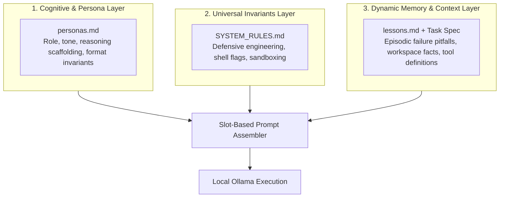
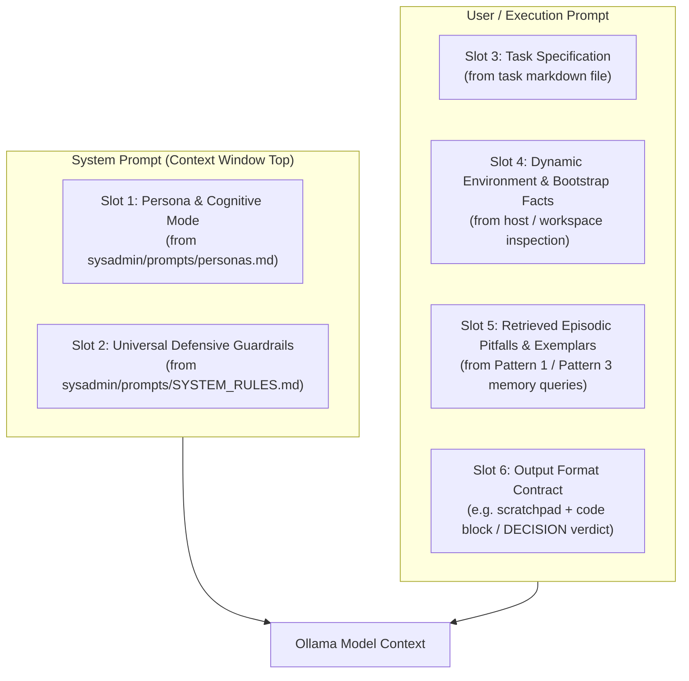
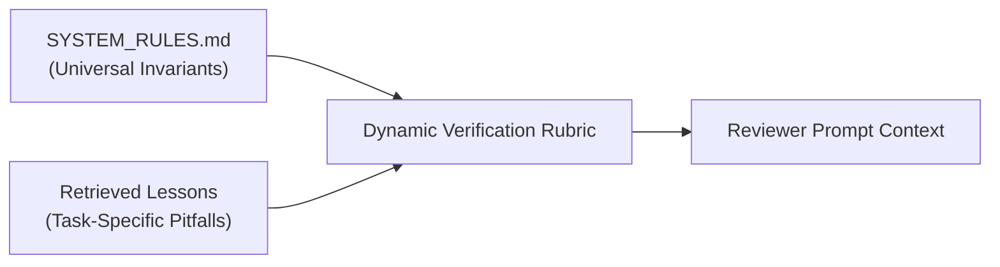
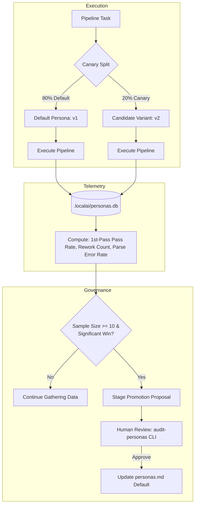

# Prompt Engineering & Evolution Strategy: Architecture & Operational Specification

> **Executive Summary**: This document specifies the architecture for dynamically assembling, measuring, and evolving system prompts, agent personas, and task prompts across the `local-ai` pipeline. It defines a **Slot-Based Assembly Engine**, an **Empirical Persona A/B Testing Framework**, and an interactive **Human Intentionality Gate** to ensure local LLMs continuously improve their cognitive and operational instructions without manual code modifications or silent drift.

---

## 1. Core Principles: Separation of Concerns

To achieve a clean, self-improving pipeline, instructions fed to local models are separated into three orthogonal layers:



1. **Cognitive & Persona Layer (`sysadmin/prompts/personas.md`)**:
   - Dictates **how** the model thinks, reasons, and structures its output (e.g. `<scratchpad>` reasoning, adversarial verification tone, markdown output contracts).
   - Evolves via **Empirical A/B Testing** and **Human Review**.
2. **Universal Invariants Layer (`sysadmin/prompts/SYSTEM_RULES.md`)**:
   - Dictates **what** technical standards must always be met (e.g. `set -euo pipefail`, trap line numbers, idempotency checks).
   - Evolves via Pattern 5 Rule Promotion in [`ai_memory_summary.md`](file:///mypool/valkyrie/home/pang/Projects/local-ai/ollama_update/ai_memory_summary.md).
3. **Dynamic Memory Layer (`ollama_update/lessons.md`)**:
   - Supplies task-specific episodic pitfalls and curated preventative rules via hybrid semantic retrieval (`.localai/memory.db`).
   - *(Note: `sysadmin/data/trajectories.jsonl` serves as the offline dataset for local LoRA / fine-tuning, while runtime prompt injection pulls exclusively from curated `lessons.md`).*

---

## 2. Slot-Based Prompt Assembly Engine

Prompts are no longer hardcoded strings inside Python files (`server.py` or `mcp_client.py`). Instead, the runtime dynamically compiles prompts from modular, versioned "slots".



### Slot Allocation & Budgeting (4096 / 8192 Token Context)
| Slot | Target Size | Content & Purpose | Source |
| :--- | :--- | :--- | :--- |
| **Slot 1 (Persona)** | 100–150 tokens | Base role, cognitive directive, and operational posture. | `sysadmin/prompts/personas.md` |
| **Slot 2 (Universal Rules)** | 250–400 tokens | Universal defensive engineering invariants. | `sysadmin/prompts/SYSTEM_RULES.md` |
| **Slot 3 (Task Spec)** | 300–800 tokens | User's prompt specification file. | `sysadmin/prompts/*.md` |
| **Slot 4 (Environment)** | 100–200 tokens | Workspace paths, bootstrap status, tool mappings. | Live host inspection |
| **Slot 5 (Episodic Memory)**| 200–400 tokens | Top-2 retrieved lessons / focused diff snippets. | `.localai/memory.db` |
| **Slot 6 (Output Contract)**| 50–100 tokens | Strict format rules (e.g. ````bash` block with zero preamble). | Runtime template |

---

## 3. Dynamic Reviewer Rubric Generation

The Reviewer model evaluates synthesized code against the exact same dynamic rules and lessons that the Author received, preventing checklist drift:



### Reviewer Prompt Structure:
1. **Persona & Cognitive Attitude**: (e.g., `persona-reviewer-strict` or `persona-reviewer-hostile`).
2. **Evaluation Inputs**: Original task spec, author's synthesized code, pre-flight linter output (`shellcheck`), environment facts.
3. **Dynamic Verification Rubric**:
   - *Universal Guardrails*: Injected from `SYSTEM_RULES.md`.
   - *Task-Specific Pitfalls*: Injected from retrieved `lessons.md`.
4. **Decision Protocol**: Strict contract requiring `DECISION: APPROVED` or `DECISION: REVISION_REQUESTED` with bulleted critique points.

---

## 4. Persona Tracking & Empirical A/B Testing

To improve the baseline prompts systematically, variations in personas and cognitive framing are tracked and measured in a local telemetry database.

### The Persona Lifecycle



### Canonical Persona Store (`sysadmin/prompts/personas.md`)
```yaml
---
id: persona-author-sysadmin
version: 1.2
status: default # [default | experimental | archived]
target: author
category: sysadmin_bash
metrics_summary:
  runs: 42
  first_pass_rate: 0.76
  parse_error_rate: 0.02
---
You are a Senior Debian Systems Administrator and Automation Engineer.
When implementing solutions:
1. <scratchpad>: Analyze execution flow, permission risks, and binary paths.
2. Complete standalone bash script inside a single ```bash block.
```

---

## 5. The Human Intentionality Gate for Prompts

> [!IMPORTANT]
> **Zero Silent Promotions**: Prompts dictate model cognition across all operations. They must **never** be silently changed in the background. The system *measures and proposes* improvements autonomously, but *promotion to default* is strictly human-gated.

### Interactive Audit CLI (`localai-mcp-client audit-personas`)
When a candidate persona accumulates $N \ge 10$ runs with statistically superior performance, the audit tool presents an interactive diff:

```text
╔══════════════════════════════════════════════════════════════════════════════╗
║ 🎭 [Persona Evolution: Proposed Default Promotion]                           ║
╚══════════════════════════════════════════════════════════════════════════════╝

🎯 Target Role: Author (Category: sysadmin_bash)
📊 Comparative Performance Benchmark:
   ┌──────────────────────┬──────────┬─────────────────┬──────────────────┐
   │ Variant              │ Samples  │ 1st-Pass Pass % │ Parse Error %    │
   ├──────────────────────┼──────────┼─────────────────┼──────────────────┤
   │ [Current Default v1] │ 45 runs  │ 62.2%           │ 8.8%             │
   │ [Candidate v2-cot]   │ 15 runs  │ 86.7% (+24.5%)  │ 0.0% (-8.8%)     │
   └──────────────────────┴──────────┴─────────────────┴──────────────────┘

📝 Prompt Diff:
   --- persona-author-sysadmin:v1 (Default)
   +++ persona-author-sysadmin:v2-cot (Candidate)
   @@ -4,2 +4,5 @@
    When given a task, follow this format:
   + <scratchpad>
   + Analyze permission risks, idempotency gates, and command paths.
   + </scratchpad>
    ```bash
    [Synthesize complete defensive script]
    ```

Actions:
  [p] Promote Candidate v2 to Default (commits to sysadmin/prompts/personas.md)
  [m] Modify Candidate prompt text before promoting
  [c] Continue Testing (collect 10 more sample runs before deciding)
  [r] Reject Candidate (archive variant and keep current default)

Action [p/m/c/r]: _
```

---

## 6. Meta-Prompting & Constraint Refactoring

### A. The Prompt Optimizer Agent
During the periodic audit (`audit-lessons` / `audit-personas`), an offline optimizer LLM reviews recurring failure patterns across recent trajectories:
* **Input**: Last 10 rejected attempts where the reviewer had to intervene.
* **Goal**: Detect ambiguities or missing instructions in the base prompt.
* **Output**: Proposes a targeted phrasing refinement to the developer.

### B. Negative-to-Positive Constraint Refactoring
LLMs frequently fail negative constraints (*"Do not do X"*), because the negative token increases attention on the forbidden action.
* **Detection**: Telemetry in `.localai/memory.db` tracks `ineffective_count`. If a rule fails $>40\%$ of the time when injected, the system flags it for refactoring.
* **Transformation**:
  - ❌ *Ineffective Negative*: `"Do not wrap commands inside write_file string payloads."`
  - ✅ *Refactored Positive*: `"Always synthesize the script into a standalone bash file and execute it directly via terminal execution."`

---

## 7. Implementation Roadmap & File Layout

| Path | Purpose | State Management |
| :--- | :--- | :--- |
| `sysadmin/prompts/personas.md` | Canonical catalog of Author & Reviewer personas and cognitive variants. | Git-versioned |
| `sysadmin/prompts/SYSTEM_RULES.md` | Universal defensive engineering invariants. | Git-versioned |
| `.localai/personas.db` | Local SQLite database tracking A/B run metrics and variant performance. | Git-ignored |
| `sysadmin/mcp_client.py` | Implements `SlotPromptAssembler` and `--explore-personas` canary routing. | Python CLI |
| `ollama_update/wiki/dashboard.md`| Compiled telemetry dashboard showing active persona rankings. | Git-versioned |
