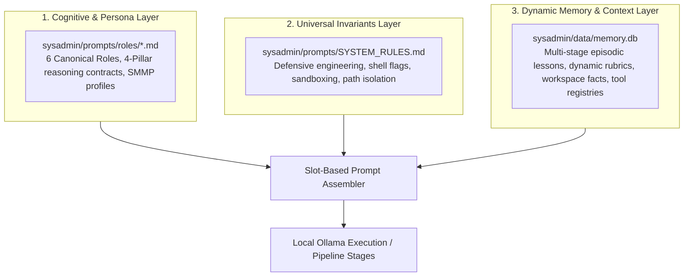
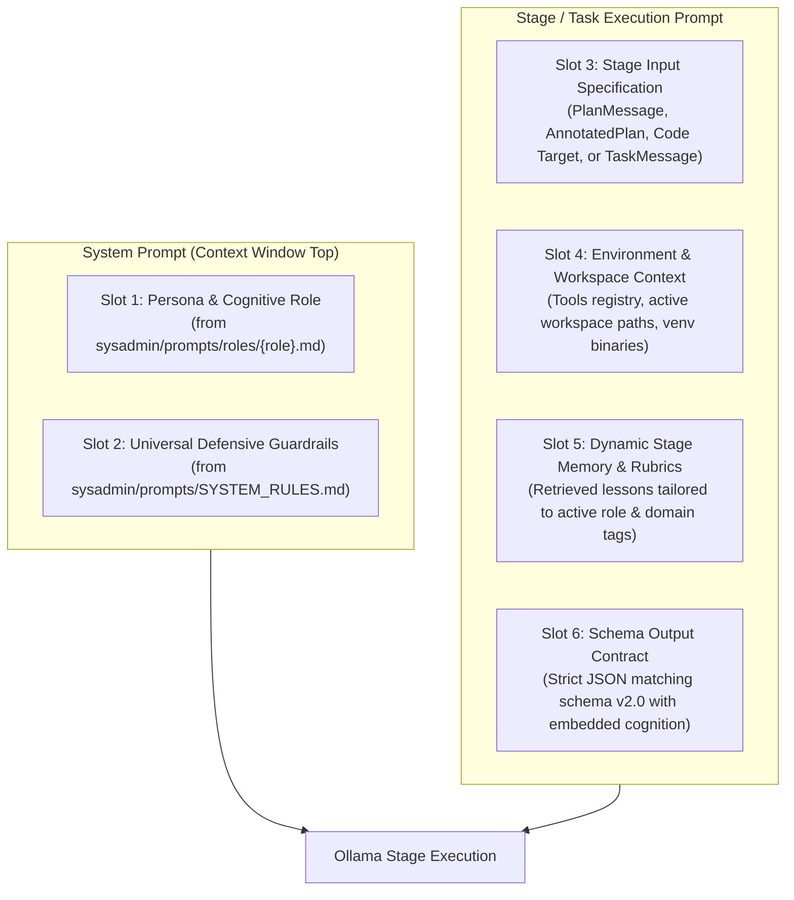

# Prompt Engineering & Evolution Strategy: Architecture & Operational Specification

> **Executive Summary**: This document specifies the architecture for dynamically assembling, measuring, and evolving system prompts, agent personas, and task prompts across the `local-ai` pipeline. It defines a **Slot-Based Assembly Engine**, an **Empirical Persona A/B Testing Framework**, and an interactive **Human Intentionality Gate** across the canonical **6-Role Horizontal Cognitive Taxonomy** (`architect`, `orchestrator`, `reviewer`, `security`, `coder`, `sysadmin`). This ensures local LLMs continuously improve their cognitive and operational instructions without manual code modifications or silent drift.

---

## 1. Core Principles: Separation of Concerns

To achieve a clean, self-improving pipeline, instructions fed to local models are separated into three orthogonal layers:



1. **Cognitive & Persona Layer (`sysadmin/prompts/roles/*.md`)**:
   - Dictates **how** each agent thinks, reasons, and structures its output across the **4 Pillars of Cognition**:
     - *Pillar 1*: Analysis & Strategy
     - *Pillar 2*: Risks & Edge Cases
     - *Pillar 3*: Solution & Decisions
     - *Pillar 4*: Verification & Testing
   - Supports 6 canonical roles: `architect`, `orchestrator`, `reviewer`, `security`, `coder`, and `sysadmin`.
   - Tuned via Single-Model Multi-Persona (SMMP) sampling profiles (`temperature`, `top_p`) and evolved via **Empirical A/B Testing**.
2. **Universal Invariants Layer (`sysadmin/prompts/SYSTEM_RULES.md`)**:
   - Dictates **what** technical standards must always be met (e.g. `set -euo pipefail`, explicit trap line numbers, deterministic venv binary paths).
   - Evolves via Rule Promotion and formal human review.
3. **Dynamic Memory & Context Layer (`sysadmin/data/memory.db`)**:
   - Supplies stage-specific episodic pitfalls, preventative rules, and dynamic verification rubrics via hybrid FTS5/BM25 retrieval.
   - Operates across **all pipeline stages** (Architect, Orchestrator, Reviewer, Security, Coder, Sysadmin).
   - *(Note: `sysadmin/data/trajectories.jsonl` preserves complete reasoning and code diffs for offline fine-tuning, while runtime prompt injection pulls exclusively from verified `MemoryStore` entries).*

---

## 2. Slot-Based Prompt Assembly Engine

Prompts are dynamically compiled at each stage of the Arc-Orc-Rev state machine from modular, versioned slots:



### Slot Allocation & Budgeting (4096 / 8192 Token Context)
| Slot | Target Size | Content & Purpose | Source |
| :--- | :--- | :--- | :--- |
| **Slot 1 (Persona)** | 150–250 tokens | Canonical role directive, 4-pillar contract, and operational posture. | `sysadmin/prompts/roles/{role}.md` |
| **Slot 2 (Universal Rules)** | 250–400 tokens | Universal defensive engineering invariants (`set -euo pipefail`, venv isolation). | `sysadmin/prompts/SYSTEM_RULES.md` |
| **Slot 3 (Stage Spec)** | 300–800 tokens | Input message payload (User prompt, PlanMessage, AnnotatedPlan, or Task). | Pipeline state / ContextStore |
| **Slot 4 (Environment)** | 100–200 tokens | Workspace paths, tool registry definitions, agent registries. | Live registry inspection |
| **Slot 5 (Stage Memory)**| 200–400 tokens | Injected lessons, architectural guidance, or dynamic audit heuristics. | `sysadmin/data/memory.db` |
| **Slot 6 (Output Contract)**| 50–100 tokens | Strict JSON schema contract requiring embedded `cognition` 4-pillar block. | Role schema specification |

### Multi-Stage Memory Injection Mapping
Dynamic memory injection is not confined to script authoring—it operates across every stage:
- **Architect Stage**: Injects `System Architecture` and `Decomposition` lessons into `user_payload["architectural_guidance"]`.
- **Orchestrator Stage**: Injects `Multi-Agent Orchestration` and task domain lessons into `user_payload["orchestration_guidance"]`.
- **Reviewer Stage**: Injects `Code Quality Toolchain` audit heuristics into `annotated_plan["audit_heuristics"]`.
- **Security Stage**: Injects `Security & Hardening` and STRIDE threat heuristics into `annotated_plan["security_heuristics"]`.
- **Executor Stages (`coder`, `sysadmin`)**: Injects domain-specific pitfalls (`Defensive Bash Scripting`, `Binary Isolation`) into `TaskMessage.description`.

---

## 3. Dynamic Rubrics & Multi-Tier Code Gates

Review and verification occur both at the architectural planning level and at the pre-execution code level to guarantee zero uninspected execution:

```mermaid
flowchart TD
    subgraph PlanGates [Planning Phase Gates]
        P_Plan[AnnotatedPlanMessage] --> P_RevPre[Reviewer Deterministic Pre-Filter<br/>validate_annotated_plan]
        P_RevPre -->|Pass| P_RevLLM[Reviewer Audit LLM<br/>Dynamic audit_heuristics]
        P_RevLLM -->|Approved| P_Sec[Security Gate LLM<br/>STRIDE threat modeling & security_heuristics]
    end

    subgraph CodeGates [Pre-Execution Code Gates (sysadmin/pipeline.py)]
        C_Write[Coder writes artifact via write_file] --> C_T1[Tier 1: Deterministic Linter Gate<br/>validate_code_output: ShellCheck, Python AST, path containment]
        C_T1 -->|Pass| C_T2A[Tier 2A: Reviewer Code Gate<br/>sysadmin/prompts/roles/reviewer_code.md]
        C_T2A -->|Approved| C_T2B[Tier 2B: Security Behavioral Gate<br/>sysadmin/prompts/roles/security_code.md]
        C_T2B -->|Cleared| C_Exec[Sysadmin Live Terminal Execution]
    end

    P_Sec -->|Cleared| C_Write
    C_T1 -->|Violations| C_Fix[Coder Rework Loop with linter errors]
    C_T2A -->|Rejected| C_Fix[Coder Rework Loop with review critique]
    C_T2B -->|Rejected| C_Fix[Coder Rework Loop with threat mitigation]
```

### Multi-Tier Code Gate Structure:
1. **Tier 1: Deterministic Linter Gate (`validator.py:validate_code_output`)**:
   - Executes `shellcheck` for `.sh` scripts (`SC2086`, `SC2164`, `SC2181`).
   - Verifies AST compilation for `.py` scripts via `ast.parse`.
   - Enforces path containment (`validate_path_containment`) preventing escape outside `WORKSPACE_ROOT`.
2. **Tier 2A: Reviewer Code Gate (`reviewer_code.md`)**:
   - Audits defensive script posture: explicit trap headers (`trap ... ERR`), line-number logging, non-zero assertion checks (`[ -x "${BIN}" ]`), and deterministic venv binary resolution.
3. **Tier 2B: Security Behavioral Gate (`security_code.md`)**:
   - Evaluates behavioral side-effects: privilege escalation (`sudo`, `setuid`), sandbox escapes, network binding, ambient `$PATH` poisoning, and file permission integrity (`umask`, `chmod`).

---

## 4. Persona Tracking & Empirical A/B Testing

To systematically measure and improve prompt variants, personas and cognitive framings are tracked via empirical telemetry:

```mermaid
flowchart TD
    subgraph Execution
        Task[Pipeline Run] --> Split{Canary Split}
        Split -->|80% Default| Base[Default Role Prompt: v1]
        Split -->|20% Canary| Cand[Candidate Variant: v2]
        Base --> Run1[Execute Pipeline]
        Cand --> Run2[Execute Pipeline]
    end

    subgraph Telemetry
        Run1 --> DB[(sysadmin/data/memory.db)]
        Run2 --> DB
        DB --> Calc[Compute: 1st-Pass Pass Rate, Revision Count, Re-execution Count]
    end

    subgraph Governance
        Calc --> Gate{Sample Size >= 10 &<br/>Significant Win?}
        Gate -->|No| KeepTesting[Continue Gathering Data]
        Gate -->|Yes| Stage[Stage Promotion Proposal]
        Stage --> Human[Human Review: audit CLI]
        Human -->|Approve| Commit[Update sysadmin/prompts/roles/{role}.md]
    end
```

---

## 5. The Human Intentionality Gate for Prompts

> [!IMPORTANT]
> **Zero Silent Promotions**: Prompts dictate model cognition across all operations. They must **never** be silently changed in the background. The system *measures and proposes* improvements autonomously, but *promotion to default* is strictly human-gated.

### Interactive Audit CLI
When candidate prompt framing accumulates $N \ge 10$ runs with statistically superior performance (e.g. higher 1st-pass clearance, lower rework count), the audit tool presents an interactive diff:

```text
╔══════════════════════════════════════════════════════════════════════════════╗
║ 🎭 [Role Prompt Evolution: Proposed Default Promotion]                       ║
╚══════════════════════════════════════════════════════════════════════════════╝

🎯 Target Role: Architect (Domain: System Architecture)
📊 Comparative Performance Benchmark:
   ┌──────────────────────┬──────────┬─────────────────┬──────────────────┐
   │ Variant              │ Samples  │ 1st-Pass Pass % │ Rework Loop %    │
   ├──────────────────────┼──────────┼─────────────────┼──────────────────┤
   │ [Current Default v1] │ 45 runs  │ 71.1%           │ 28.9%            │
   │ [Candidate v2-cot]   │ 16 runs  │ 93.8% (+22.7%)  │ 6.2% (-22.7%)    │
   └──────────────────────┴──────────┴─────────────────┴──────────────────┘

📝 Prompt Diff:
   --- sysadmin/prompts/roles/architect.md (Default)
   +++ sysadmin/prompts/roles/architect.md (Candidate)
   @@ -12,2 +12,6 @@
    When decomposing user tasks into PlanMessage:
   + - Explicitly isolate script authoring (coder) from execution (sysadmin).
   + - Map data dependencies between creation tasks and test assertions.

Actions:
  [p] Promote Candidate v2 to Default (commits to sysadmin/prompts/roles/architect.md)
  [m] Modify Candidate prompt text before promoting
  [c] Continue Testing (collect 10 more sample runs before deciding)
  [r] Reject Candidate (archive variant and keep current default)

Action [p/m/c/r]: _
```

---

## 6. Meta-Prompting & Constraint Refactoring

### A. The Prompt Optimizer Agent
During the periodic audit (`audit-lessons`), an offline optimizer reviews recurring failure patterns across recent trajectories stored in `sysadmin/data/trajectories.jsonl`:
* **Input**: Last 10 rejected attempts where Reviewer or Security intervened.
* **Goal**: Detect ambiguities, missing constraints, or conflicting directions in the base prompt.
* **Output**: Proposes a targeted phrasing refinement to the developer.

### B. Negative-to-Positive Constraint Refactoring
LLMs frequently fail negative constraints (*"Do not do X"*), because negative tokens prime attention on the forbidden action.
* **Detection**: Telemetry in `sysadmin/data/memory.db` tracks `ineffective_count`. If a rule fails $>40\%$ of the time when injected, the system flags it for refactoring.
* **Transformation**:
  - ❌ *Ineffective Negative*: `"Do not wrap commands inside write_file string payloads."`
  - ✅ *Refactored Positive*: `"Always synthesize standalone scripts into files and delegate execution to downstream sysadmin tasks."`

---

## 7. Implementation File Layout & State Management

| Path | Purpose | State Management |
| :--- | :--- | :--- |
| `sysadmin/prompts/roles/*.md` | Canonical catalog of the 6 roles (`architect`, `orchestrator`, `reviewer`, `security`, `coder`, `sysadmin`). | Git-versioned |
| `sysadmin/prompts/roles/reviewer_code.md` | Pre-execution code audit prompt (Tier 2A Code Gate). | Git-versioned |
| `sysadmin/prompts/roles/security_code.md` | Pre-execution behavioral STRIDE audit prompt (Tier 2B Security Gate). | Git-versioned |
| `sysadmin/prompts/SYSTEM_RULES.md` | Universal defensive engineering invariants. | Git-versioned |
| `sysadmin/data/memory.db` | Local SQLite database tracking lessons, pending review queue, and retrieval telemetry. | Git-ignored |
| `sysadmin/data/trajectories.jsonl` | Multi-agent trajectory records capturing 4-pillar cognition, script versions, and diffs. | Git-ignored |
| `sysadmin/pipeline.py` | State machine orchestrator executing multi-stage injection, gates, and attribution. | Python Runtime |
| `sysadmin/validator.py` | Deterministic validators (Plan validator, ShellCheck, Python AST, path containment). | Python Runtime |
| `ollama_update/wiki/dashboard.md` | Compiled telemetry dashboard showing active lesson utility and model metrics. | Git-versioned |
