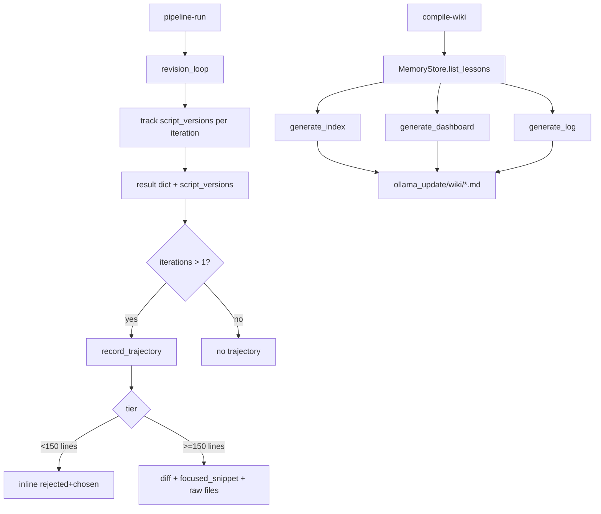

# Phase 7 — Trajectory Recording & Wiki Dashboard — Implementation Plan

> **Source**: [`ollama_update/memory_multi-phase_implementation_summary.md`](../ollama_update/memory_multi-phase_implementation_summary.md) §Phase 7
> **Status**: Phases 1–6 ✅ COMPLETE. Phase 7 pending.

## Goal

Record rejected/approved script pairs for future fine-tuning data, and generate a
human-readable wiki dashboard of memory health.

## Deliverables (5 sub-phases)

### 7.01 — Trajectory Recorder (Pipeline Hook)
- New file [`sysadmin/mcp_core/trajectories.py`](sysadmin/mcp_core/trajectories.py)
- `record_trajectory(pipeline_result, prompt_content, trajectories_path) -> str`
- Appends one JSON line to `sysadmin/data/trajectories.jsonl`
- Hook in `pipeline.py` for any run with `iterations > 1`

### 7.02 — Tiered Schema (Inline vs. Diff+Ref)
- `record_trajectory()` tiered logic: <150 lines inline, ≥150 lines diff+ref
- `focused_snippet` (±15 lines around failure point), `diff` (unified)

### 7.03 — Wiki Index Generator
- New file [`sysadmin/mcp_core/wiki.py`](sysadmin/mcp_core/wiki.py)
- `generate_index(lessons, output_path)` — categorized markdown tables

### 7.04 — Wiki Dashboard Generator
- `generate_dashboard(lessons, output_path)` + `generate_log(events, output_path)`

### 7.05 — `compile-wiki` CLI & Tests
- `CompileWikiCommand` in `memory.py`; runs all three generators

## Critical Design Finding

**`revision_loop` currently retains only `final_code_block`** (the last version).
Phase 7.01/7.02 requires `rejected` (earlier) and `chosen` (final) script pairs.
Therefore Phase 7 must add **version tracking** to `revision_loop`:

- Add `script_versions: list[str]` accumulating each iteration's `final_code_block`
  (after sanitization, before lint/review).
- Add to result dict: `"script_versions": [...]` (ordered oldest→newest).
- `rejected` = all versions except the last; `chosen` = last version.
- For a 2-iteration run: `rejected = [v1]`, `chosen = v2`.
- For a 1-iteration pass: no trajectory (iterations == 1 → no-op).

This is a **backward-compatible additive change** — existing result-dict consumers
(`_apply_telemetry`, `_stage_lesson_if_rework`, `execute`) are unaffected.

## Design Decisions

### Trajectory record shape (7.01)
```json
{
  "id": "traj-YYYYMMDD-HHMMSS-<rand>",
  "timestamp": "<ISO-8601 UTC>",
  "task_file": "<args.file>",
  "injected_lessons": ["l1", "l2"],
  "reviewer_critique": "<last_critique>",
  "iterations": 2,
  "outcome": "approved" | "failed" | "aborted",
  "payload_type": "inline" | "diff_and_ref",
  "rejected": "<script text or null>",
  "chosen": "<script text or null>",
  "diff": "<unified diff or null>",
  "focused_snippet": "<snippet or null>",
  "raw_dir": "<relative dir or null>"
}
```

### Tiered schema (7.02)
- **Tier 1** (`chosen` < 150 lines): `payload_type="inline"`, `rejected` + `chosen`
  stored inline as strings; `diff`/`focused_snippet`/`raw_dir` = null.
- **Tier 2** (`chosen` ≥ 150 lines): `payload_type="diff_and_ref"`; `diff` +
  `focused_snippet` inline; verbatim `rejected`/`chosen` written to
  `sysadmin/data/raw_trajectories/<id>/rejected.sh` and `chosen.sh`; `raw_dir`
  records the relative path; `rejected`/`chosen` inline fields = null.
- `diff`: `difflib.unified_diff(rejected.splitlines(), chosen.splitlines(), lineterm="")`.
- `focused_snippet`: ±15 lines around the first line of `chosen` that matches a
  reviewer-critique keyword; fallback to the first 30 lines if no match.

### Wiki index (7.03)
- Group lessons by `category`; one markdown table per category.
- Columns: `ID` (Obsidian `[[id]]` link), `Keywords`, `Rule` (truncated ~60 chars),
  `Source Task`, `Created`.
- Empty list → `# Lesson Index` + `No lessons recorded.`

### Wiki dashboard (7.04)
- Sections: Top-retrieved (by `retrieval_count` desc), Highest-utility (by
  `utility_score` desc), Promotion candidates (`cluster_lessons`), Low-utility
  flags (`flag_low_utility`).
- `generate_log(events, output_path)`: append-only chronological entries.

### compile-wiki CLI (7.05)
- `CompileWikiCommand` (`@command`, name `compile-wiki`).
- Loads `MemoryStore.list_lessons()`, creates `ollama_update/wiki/`, calls
  `generate_index`, `generate_dashboard`, `generate_log`.
- Summary: `📚 Wiki compiled: index.md (N lessons), dashboard.md, log.md`.

## Files Changed / Created

| File | Action |
|:---|:---|
| [`sysadmin/mcp_core/trajectories.py`](sysadmin/mcp_core/trajectories.py) | CREATE |
| [`sysadmin/mcp_core/wiki.py`](sysadmin/mcp_core/wiki.py) | CREATE |
| [`sysadmin/mcp_cli/commands/pipeline.py`](sysadmin/mcp_cli/commands/pipeline.py) | EDIT (version tracking + trajectory hook) |
| [`sysadmin/mcp_cli/commands/memory.py`](sysadmin/mcp_cli/commands/memory.py) | EDIT (add `CompileWikiCommand`) |
| [`sysadmin/tests/test_trajectories.py`](sysadmin/tests/test_trajectories.py) | CREATE |
| [`sysadmin/tests/test_wiki.py`](sysadmin/tests/test_wiki.py) | CREATE |
| [`sysadmin/tests/test_compile_wiki.py`](sysadmin/tests/test_compile_wiki.py) | CREATE |
| [`sysadmin/tests/test_cli.py`](sysadmin/tests/test_cli.py) | EDIT (add `compile-wiki`) |
| [`sysadmin/tests/test_pipeline.py`](sysadmin/tests/test_pipeline.py) | EDIT (trajectory hook + version tracking) |

## Acceptance Criteria Mapping

| Sub-phase | Criteria |
|:---|:---|
| 7.01 | 2-iteration run → one new JSONL line; valid JSON; iteration-1 pass → no record |
| 7.02 | 50-line → inline; 200-line → diff+ref with raw files; valid unified diff |
| 7.03 | 10 lessons / 3 categories → 3 tables; empty → "No lessons recorded"; valid md |
| 7.04 | 10 lessons → leaderboard tables; log append-only; valid md |
| 7.05 | `compile-wiki` generates 3 files; idempotent; unit tests |

## Flow


