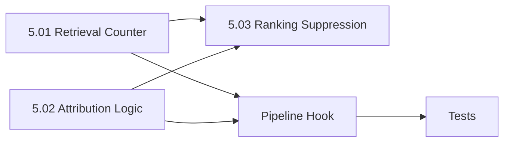

# Phase 5 — Retrieval Telemetry & Attribution — Implementation Plan

> **Source**: [`ollama_update/memory_multi-phase_implementation_summary.md`](../ollama_update/memory_multi-phase_implementation_summary.md) §Phase 5
> **Status**: Phases 1–4 ✅ COMPLETE. Phase 5 tracks whether injected lessons actually prevented rework, and decays ineffective lessons out of top-K results.

---

## Goal

Track whether injected lessons actually prevented rework, and decay ineffective lessons out of top-K results over time.

---

## Current State (verified)

- [`MemoryStore`](../sysadmin/mcp_core/memory.py:165) already has `retrieval_count`, `prevented_rework_count`, `ineffective_count` columns (default 0) on the `lessons` table, and `insert_lesson`/`update_lesson`/`get_lesson`/`list_lessons` CRUD.
- [`search_lessons`](../sysadmin/mcp_core/memory.py:400) returns FTS5 BM25-ranked lessons with a `rank` field (lower = better). No utility weighting yet.
- [`search_lessons_hybrid`](../sysadmin/mcp_core/memory.py:477) merges FTS5 + vector scores; no suppression factor yet.
- [`revision_loop`](../sysadmin/mcp_cli/commands/pipeline.py:107) already returns `injected_lessons` (list of IDs) and `last_critique` (reviewer critique text) in its result dict.
- [`PipelineRunCommand.run`](../sysadmin/mcp_cli/commands/pipeline.py:82) calls `revision_loop()` then `_stage_lesson_if_rework()` — the natural place to add telemetry/attribution after the loop.
- Tests use `tmp_path` DBs + monkeypatched `transport.call_mcp` (see [`conftest.py`](../sysadmin/tests/conftest.py:17)).

---

## Sub-Phase Breakdown

### Phase 5.01 — Retrieval Counter Updates

**Modify**: [`sysadmin/mcp_core/memory.py`](../sysadmin/mcp_core/memory.py)

- `MemoryStore.increment_retrieval_count(lesson_ids: list[str]) -> None` — batch increment `retrieval_count` for each ID (single `UPDATE ... WHERE id IN (...)` or per-ID loop). No-op on empty list.

**Modify**: [`sysadmin/mcp_cli/commands/pipeline.py`](../sysadmin/mcp_cli/commands/pipeline.py)

- After `revision_loop()` returns (in `run()`), call `increment_retrieval_count(result["injected_lessons"])` inside a `MemoryStore` context. Never blocks on failure.

**Acceptance**:
- Injecting lessons A and B → both `retrieval_count += 1`.
- No injected lessons → no rows modified.
- Counter persists across sessions (disk-backed).

---

### Phase 5.02 — Attribution Logic (Blame / Innocent / Credit)

**New file**: [`sysadmin/mcp_core/attribution.py`](../sysadmin/mcp_core/attribution.py)

- `attribute_lessons(injected_lessons: list[dict], pipeline_result: dict, reviewer_critique: str) -> dict[str, str]`
  - Returns `lesson_id → "credited" | "blamed" | "innocent"`.
  - **Pass on iteration 1** (`iterations == 1 AND approved`): all injected → `"credited"`.
  - **Rework occurred** (`iterations > 1`): compare each lesson's keywords against reviewer-critique keywords:
    - Overlap → `"blamed"`.
    - No overlap → `"innocent"`.
- `MemoryStore.update_telemetry(lesson_id, field, increment=1)` — generic counter update (guards field against `retrieval_count`/`prevented_rework_count`/`ineffective_count`).

**Modify**: [`sysadmin/mcp_cli/commands/pipeline.py`](../sysadmin/mcp_cli/commands/pipeline.py)

- After `revision_loop()`, compute attribution and apply counter updates:
  - `"credited"` → `prevented_rework_count += 1`
  - `"blamed"` → `ineffective_count += 1`
  - `"innocent"` → no counter change
- Needs the injected lesson dicts (not just IDs) to read keywords. `_inject_lessons` currently returns only IDs — extend it (or re-fetch lessons by ID) to also return the lesson dicts.

**Acceptance**:
- Iteration-1 pass credits all injected lessons.
- Lesson with keyword "heredoc" blamed when critique mentions "heredoc".
- Lesson with keyword "ansible" innocent when critique is about "heredoc".
- Counters reflect attribution in the DB.

---

### Phase 5.03 — Dynamic Ranking Suppression & Tests

**Modify**: [`sysadmin/mcp_core/memory.py`](../sysadmin/mcp_core/memory.py)

- `search_lessons()`: apply utility multiplier `(prevented + 1) / (retrieved + 2)` to the BM25 score. Since BM25 rank is negative (lower = better), multiply the rank by the inverse of the multiplier (or compute a weighted score and re-sort). Final ordering must suppress high-retrieval/low-prevention lessons.
- `search_lessons_hybrid()`: apply the same suppression factor to the combined score.

**Acceptance**:
- Lesson retrieved 10× / 0 prevented ranks lower than lesson retrieved 2× / 1 prevented (similar BM25).
- Brand-new lesson (0/0) gets neutral `1 × (1/2) = 0.5` multiplier — not penalized.
- Unit tests with synthetic counters verify ranking order changes.

---

## Dependency Graph

- 5.01 and 5.02 are independent (both feed the pipeline hook).
- 5.03 depends on the counter columns (already present) and the suppression formula.
- The pipeline hook (in `run()`) wires 5.01 + 5.02 together.

---

## Files Touched

| File | Action |
|:---|:---|
| [`sysadmin/mcp_core/memory.py`](../sysadmin/mcp_core/memory.py) | **Modify** — `increment_retrieval_count`, `update_telemetry`, suppression in `search_lessons`/`search_lessons_hybrid` |
| [`sysadmin/mcp_core/attribution.py`](../sysadmin/mcp_core/attribution.py) | **New** — `attribute_lessons` |
| [`sysadmin/mcp_cli/commands/pipeline.py`](../sysadmin/mcp_cli/commands/pipeline.py) | **Modify** — telemetry + attribution hook in `run()`; `_inject_lessons` returns lesson dicts |
| [`sysadmin/tests/test_attribution.py`](../sysadmin/tests/test_attribution.py) | **New** — attribution unit tests |
| [`sysadmin/tests/test_memory.py`](../sysadmin/tests/test_memory.py) | **Modify** — counter + suppression tests |
| [`sysadmin/tests/test_pipeline.py`](../sysadmin/tests/test_pipeline.py) | **Modify** — telemetry/attribution hook tests |

---

## Key Design Decisions

1. **`_inject_lessons` must return lesson dicts** (not just IDs) so attribution can read `keywords`. Change its return to `(enriched_prompt, injected_lessons: list[dict])`, and derive `injected_lessons` IDs in the result dict from those dicts. This keeps `revision_loop`'s `injected_lessons` field as IDs (backward-compatible with Phase 4 tests) while giving `run()` access to full dicts.

2. **Suppression formula direction**: BM25 `rank` is negative (lower = better). To suppress, compute `weighted = rank / multiplier` (dividing a negative by a small positive makes it more negative = worse) OR compute a positive "score" and sort descending. Implementation will use a positive utility score for clarity: `score = -bm25_rank × multiplier`, sort descending.

3. **Attribution keyword overlap**: reuse the tokenization approach from `extraction._extract_keywords` (lowercase, stopword-filtered) for both lesson keywords and critique text. Overlap = any shared token.

4. **Telemetry never blocks**: all counter/attribution updates wrapped in try/except with `logger.warning`, mirroring the Phase 2/4 staging/injection pattern.

---

## Acceptance Gate (Phase 5 complete)

- [ ] `increment_retrieval_count` batch-increments and persists; no-op on empty.
- [ ] `attribute_lessons` returns correct credited/blamed/innocent mapping.
- [ ] `update_telemetry` updates the correct counter column.
- [ ] Pipeline applies retrieval + attribution counters after each run.
- [ ] `search_lessons`/`search_lessons_hybrid` suppress low-utility lessons.
- [ ] All tests pass: `python3 -m pytest sysadmin/tests/ -v`.
