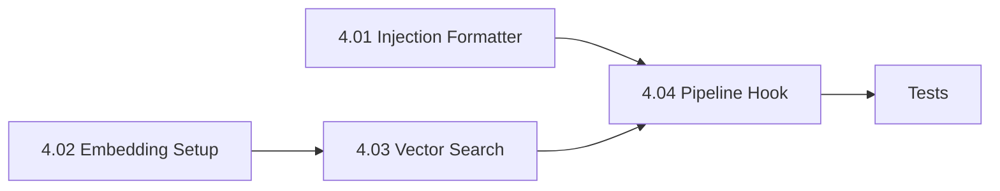

# Phase 4 — Lesson Injection (Pipeline Read Path) — Implementation Plan

> **Source**: [`ollama_update/memory_multi-phase_implementation_summary.md`](../ollama_update/memory_multi-phase_implementation_summary.md) §Phase 4
> **Status**: Phases 1–3 ✅ COMPLETE. Phase 4 is the read path: query memory for relevant lessons and inject them into the Author prompt before iteration 1.

---

## Goal

Before the Author's first iteration, query the memory store for lessons relevant to the current task prompt and inject the top-K into the Author's context.

---

## Current State (verified)

- [`MemoryStore`](../sysadmin/mcp_core/memory.py:113) already has `search_lessons(query, top_k=3)` (FTS5 BM25) and full CRUD. No embeddings column yet.
- [`PipelineRunCommand.revision_loop()`](../sysadmin/mcp_cli/commands/pipeline.py:105) builds `current_prompt = prompt_content` and loops. Injection must happen before iteration 1.
- [`transport.call_mcp`](../sysadmin/mcp_core/transport.py:21) is the JSON-RPC bridge to `server.py`. There is **no** embedding tool in the MCP server (no `/api/embed` handler), so `get_embedding` must call Ollama's HTTP API directly.
- [`server.py`](../sysadmin/mcp_ollama/server.py:52) already has `_http_request()` + `OLLAMA_HOST` for direct HTTP — the same pattern will be reused in `embeddings.py`.
- Tests use `tmp_path` DBs and monkeypatched `transport.call_mcp` (see [`conftest.py`](../sysadmin/tests/conftest.py:17)).

---

## Sub-Phase Breakdown

### Phase 4.01 — Injection Formatter

**New file**: [`sysadmin/mcp_core/injection.py`](../sysadmin/mcp_core/injection.py)

- `format_lessons_for_prompt(lessons: list[dict]) -> str`
- Renders a `### Relevant Lessons from Past Runs` markdown section.
- Each lesson → numbered block with rule text, category, keywords.
- Returns `""` when `lessons` is empty (no header injected).
- No raw JSON — human-readable rule text only.

**Acceptance**:
- 3 lessons → readable section with 3 numbered blocks.
- Empty list → `""`.
- No raw JSON in output.

---

### Phase 4.02 — Embedding Model Setup

**New file**: [`sysadmin/mcp_core/embeddings.py`](../sysadmin/mcp_core/embeddings.py)

- `get_embedding(text: str, model: str = "nomic-embed-text") -> list[float]`
- Calls Ollama HTTP API `POST /api/embed` directly (reuse `OLLAMA_HOST` resolution + `urllib`, mirroring `server.py`).
- Returns a float vector; raises on failure.
- Model pull: `ollama pull nomic-embed-text` (manual/CLI step, documented).

**Acceptance**:
- `ollama list` shows `nomic-embed-text`.
- `get_embedding("test sentence")` returns `list[float]` with `len > 0`.
- Importable from `sysadmin/`.

---

### Phase 4.03 — Vector Search with `sqlite-vec`

**Modify**: [`sysadmin/mcp_core/memory.py`](../sysadmin/mcp_core/memory.py)

- `pip install sqlite-vec` in the sysadmin venv.
- Add `embeddings` BLOB column to `lessons` (schema migration — `ALTER TABLE ... ADD COLUMN` guarded by existence check, since existing DBs won't have it).
- `insert_lesson()`: store embedding if provided.
- `search_lessons_vector(query_embedding, top_k=3) -> list[dict]` — cosine similarity via `sqlite-vec`.
- `search_lessons_hybrid(query_text, query_embedding, top_k=3) -> list[dict]` — combines FTS5 BM25 + vector scores.
- **Graceful degradation**: if `sqlite-vec` is not importable, `search_lessons_hybrid` falls back to FTS5-only (`search_lessons`).

**Acceptance**:
- 5 lessons with embeddings → vector search returns correct lesson first.
- Hybrid combines both signals.
- `sqlite-vec` missing → hybrid degrades to FTS5-only.

> **Deferral note**: If `sqlite-vec` install fails, Phase 4.03 is deferred and Phase 4.04 ships with FTS5-only search (per the summary's explicit fallback).

---

### Phase 4.04 — Pipeline Injection Hook & Tests

**Modify**: [`sysadmin/mcp_cli/commands/pipeline.py`](../sysadmin/mcp_cli/commands/pipeline.py)

- In `revision_loop()`, before iteration 1: query `search_lessons` (or `search_lessons_hybrid`) with `prompt_content` as query.
- Prepend `format_lessons_for_prompt()` output to `current_prompt`.
- Track `injected_lessons` (list of lesson IDs) in the result dict.
- Terminal banner: `📚 Injected N relevant lessons from memory`.
- No matches → no injection, no banner.

**New tests**: [`sysadmin/tests/test_injection.py`](../sysadmin/tests/test_injection.py) + additions to [`test_pipeline.py`](../sysadmin/tests/test_pipeline.py)

**Acceptance**:
- "heredoc" lesson retrieved/injected when prompt mentions "heredoc".
- Result includes `injected_lessons` list.
- Zero lessons → identical behavior (no regression).
- Unit tests verify injection appears in Author prompt.

---

## Dependency Graph

- 4.01 is independent (pure function).
- 4.02 → 4.03 (embeddings feed vector search).
- 4.04 depends on 4.01 (formatter) and optionally 4.03 (hybrid search).
- 4.04 can ship with FTS5-only if 4.03 is deferred.

---

## Files Touched

| File | Action |
|:---|:---|
| [`sysadmin/mcp_core/injection.py`](../sysadmin/mcp_core/injection.py) | **New** — formatter |
| [`sysadmin/mcp_core/embeddings.py`](../sysadmin/mcp_core/embeddings.py) | **New** — `get_embedding` |
| [`sysadmin/mcp_core/memory.py`](../sysadmin/mcp_core/memory.py) | **Modify** — embeddings column + vector/hybrid search |
| [`sysadmin/mcp_cli/commands/pipeline.py`](../sysadmin/mcp_cli/commands/pipeline.py) | **Modify** — injection hook |
| [`sysadmin/tests/test_injection.py`](../sysadmin/tests/test_injection.py) | **New** — formatter tests |
| [`sysadmin/tests/test_memory.py`](../sysadmin/tests/test_memory.py) | **Modify** — vector/hybrid search tests |
| [`sysadmin/tests/test_pipeline.py`](../sysadmin/tests/test_pipeline.py) | **Modify** — injection hook tests |

---

## Open Questions / Decisions

1. **Embedding transport**: No MCP embedding tool exists. Plan uses direct HTTP to Ollama `/api/embed` (consistent with `server.py`). Alternative: add an `ollama_embed` tool to `server.py`. **Recommendation**: direct HTTP in `embeddings.py` (simpler, no server change).
2. **`sqlite-vec` availability**: unknown until install attempted. Plan handles graceful FTS5-only fallback.
3. **Schema migration**: existing `.localai/memory.db` lacks `embeddings` column. Plan uses guarded `ALTER TABLE ADD COLUMN`.

---

## Acceptance Gate (Phase 4 complete)

- [ ] `format_lessons_for_prompt` renders readable markdown; empty → `""`.
- [ ] `get_embedding` returns a float vector (or documented deferral).
- [ ] Vector/hybrid search works, or degrades to FTS5-only.
- [ ] Pipeline injects relevant lessons before iteration 1; `injected_lessons` tracked; banner shown.
- [ ] Zero-lesson store → no regression.
- [ ] All tests pass: `python3 -m pytest sysadmin/tests/ -v`.
