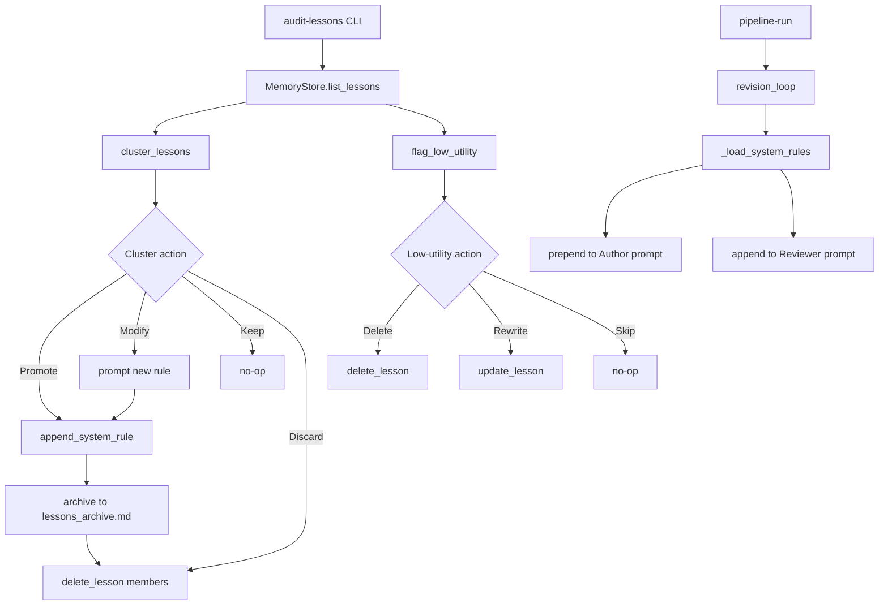

# Phase 6 — Audit, Promotion & System Rules — Implementation Plan

> **Source**: [`ollama_update/memory_multi-phase_implementation_summary.md`](../ollama_update/memory_multi-phase_implementation_summary.md) §Phase 6
> **Status**: Phases 1–5 ✅ COMPLETE. Phase 6 pending.

## Goal

`audit-lessons` CLI clusters related lessons, promotes recurring patterns to
`SYSTEM_RULES.md`, flags low-utility lessons for cleanup, and `pipeline.py`
auto-loads `SYSTEM_RULES.md` into both Author and Reviewer prompts.

## Deliverables (5 sub-phases)

### 6.01 — Lesson Clustering Engine
- New file [`sysadmin/mcp_core/audit.py`](sysadmin/mcp_core/audit.py)
- `cluster_lessons(lessons, min_cluster_size=3) -> list[dict]`
- `flag_low_utility(lessons, min_retrievals=5, max_prevention_ratio=0.3) -> list[dict]`
- Pure functions (no DB/file I/O).

### 6.02 — `SYSTEM_RULES.md` Writer
- New file [`sysadmin/mcp_core/rules_writer.py`](sysadmin/mcp_core/rules_writer.py)
- `append_system_rule(rule_text, source_lesson_ids, rules_md_path) -> None`
- Auto-increments `### Rule #N` numbering; provenance metadata.

### 6.03 — Low-Utility Flagging
- `flag_low_utility()` in `audit.py` (above).

### 6.04 — Interactive `audit-lessons` CLI
- Extend [`sysadmin/mcp_cli/commands/memory.py`](sysadmin/mcp_cli/commands/memory.py)
  with `AuditLessonsCommand` (`@command`).
- Cluster promote / low-utility cleanup flow; archive to `lessons_archive.md`.

### 6.05 — Pipeline Auto-Load of System Rules
- Update [`sysadmin/mcp_cli/commands/pipeline.py`](sysadmin/mcp_cli/commands/pipeline.py)
  to read `SYSTEM_RULES.md` and inject into Author + Reviewer prompts.

## Design Decisions

### Clustering algorithm (6.01)
- Build keyword set per lesson (normalize to lowercase).
- Two lessons "related" if: share ≥2 keywords **OR** same category.
- Union-find / connected-components over the "related" relation.
- Emit clusters with `count >= min_cluster_size`, sorted by size desc.
- Cluster dict: `{"keywords": [...], "category": str, "lesson_ids": [...], "count": int}`.
  - `keywords`: union of member keywords (deduped).
  - `category`: most common category among members.

### Low-utility flagging (6.03)
- `prevention_ratio = prevented_rework_count / retrieval_count` (0 when retrieval=0).
- Flag when `retrieval_count >= min_retrievals` AND `prevention_ratio < max_prevention_ratio`.
- Each flagged lesson gains `prevention_ratio` and `utility_score` fields.
- `utility_score` reuses the Phase 5 multiplier `(prevented+1)/(retrieved+2)`.

### SYSTEM_RULES writer (6.02)
- Format matches skeleton in [`sysadmin/prompts/SYSTEM_RULES.md`](sysadmin/prompts/SYSTEM_RULES.md):
  ```
  ### Rule #N: <Title>
  **Promoted**: <date> | **Source Lessons**: <id1>, <id2>

  <rule text>
  ```
- Title derived from first line of rule text (truncated ~60 chars).
- Number = count of existing `### Rule #` headers + 1.
- Append below the `<!-- Rules are appended below... -->` marker.

### audit-lessons CLI (6.04)
- Loads all active lessons via `MemoryStore.list_lessons()`.
- Runs `cluster_lessons()` + `flag_low_utility()`.
- Per cluster prompt: `[p] Promote`, `[m] Modify rule`, `[k] Keep episodic`, `[d] Discard`.
  - **Promote**: `append_system_rule()`; archive source lessons to
    `ollama_update/lessons_archive.md`; `delete_lesson()` each member.
  - **Modify**: prompt for new rule text, then promote.
  - **Keep**: no-op (lessons stay active).
  - **Discard**: `delete_lesson()` each member (no archive).
- Per low-utility lesson prompt: `[d] Delete`, `[m] Rewrite`, `[s] Skip`.
- Summary at end.

### Pipeline auto-load (6.05)
- New helper `_load_system_rules()` reads `sysadmin/prompts/SYSTEM_RULES.md`.
- Returns `""` when file missing/empty (no regression).
- In `revision_loop()`: prepend rules to `current_prompt` as
  `### Universal System Rules` section (before lesson injection).
- In `_build_review_prompt()`: append rules as additional verification reference.
- Rules content cached per-run (read once, passed through).

## Files Changed / Created

| File | Action |
|:---|:---|
| [`sysadmin/mcp_core/audit.py`](sysadmin/mcp_core/audit.py) | CREATE |
| [`sysadmin/mcp_core/rules_writer.py`](sysadmin/mcp_core/rules_writer.py) | CREATE |
| [`sysadmin/mcp_cli/commands/memory.py`](sysadmin/mcp_cli/commands/memory.py) | EDIT (add `AuditLessonsCommand`) |
| [`sysadmin/mcp_cli/commands/pipeline.py`](sysadmin/mcp_cli/commands/pipeline.py) | EDIT (auto-load rules) |
| [`sysadmin/tests/test_audit.py`](sysadmin/tests/test_audit.py) | CREATE |
| [`sysadmin/tests/test_rules_writer.py`](sysadmin/tests/test_rules_writer.py) | CREATE |
| [`sysadmin/tests/test_audit_lessons.py`](sysadmin/tests/test_audit_lessons.py) | CREATE |
| [`sysadmin/tests/test_cli.py`](sysadmin/tests/test_cli.py) | EDIT (add `audit-lessons` to EXPECTED_COMMANDS) |
| [`sysadmin/tests/test_pipeline.py`](sysadmin/tests/test_pipeline.py) | EDIT (rules auto-load tests) |

## Acceptance Criteria Mapping

| Sub-phase | Criteria |
|:---|:---|
| 6.01 | 5 heredoc/EOF/delimiter lessons cluster; 2 unrelated don't at size 3; pure function |
| 6.02 | `### Rule #1` then `### Rule #2`; provenance date + source IDs |
| 6.03 | 8/0 flagged; 8/4 not; 3/0 not (below threshold) |
| 6.04 | `audit-lessons` runs; promoted rule in SYSTEM_RULES.md; archive moves lessons; low-utility flagged with stats |
| 6.05 | rules in both prompts; empty file = no-op; unit tests |

## Test Strategy

- `test_audit.py`: clustering (heredoc cluster, unrelated no-cluster, pure function),
  low-utility flagging (3 threshold cases).
- `test_rules_writer.py`: first rule `#1`, second `#2`, provenance fields.
- `test_audit_lessons.py`: mocked `input()`; promote → SYSTEM_RULES.md + archive +
  active-table removal; low-utility delete/rewrite/skip; summary counts.
- `test_pipeline.py`: rules present in Author + Reviewer prompts; empty file no-op.
- `test_cli.py`: `audit-lessons` registered.

## Flow


